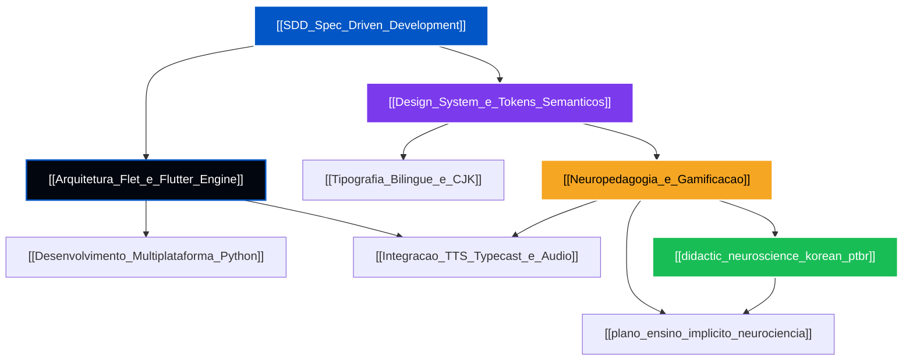

# 🧠 Central Mestre de Conceitos — Sejong Companion (세종학당 컴패니언)

**Projeto:** Sejong Companion (Flet / Python + Flutter Engine)  
**Padrão de Documentação:** Obsidian Knowledge Graph (`[[Wikilinks]]` + Markdown Standard)  
**Última Atualização:** 2026-07-24  

---

## 🧭 Visão Geral e Mapa da Rede do Conhecimento

Esta central consolida os **fundamentos teóricos, arquiteturais, de engenharia de software, design system e neuropedagogia** que regem a construção do aplicativo **Sejong Companion**. 

Diferente de uma documentação estática, cada conceito aqui catalogado é um **nó ativo de conhecimento**, interconectado através de `[[Wikilinks]]` aos planos de implementação (`/Planos_e_Arquitetura`), relatórios de pesquisa (`/Viabilidade_e_Pesquisa`), históricos (`/Changelogs_e_Historico`) e diagnósticos de bugs críticos (`/Bugs_Criticos`).

---

## 🗂️ Matriz de Conceitos Catalogados

### 1. 📐 Engenharia de Software e Metodologia
- 📄 **[[SDD_Spec_Driven_Development]]** — Desenvolvimento guiado por especificações rigorosas e contrato de tokens únicos (*Single Source of Truth*). Elimina a estilização *ad-hoc*, reduzindo a dívida técnica e garantindo alinhamento entre o protótipo Next.js/Tailwind v4 e o aplicativo final Flet.
  - *Documentos Relacionados:* [[Plano_UIUX_Flet_Sejong_Companion]], [[implementation_plan]], [[analise_stack_multiplataforma]]

- 📱 **[[Desenvolvimento_Multiplataforma_Python]]** — Engenharia de aplicação nativa multiplataforma (Web PWA, Android APK, iOS Bundle) a partir de uma única base de código em Python. Analisa especificidades de sockets no Windows (`127.0.0.1`), alocação de memória e empacotamento.
  - *Documentos Relacionados:* [[analise_stack_multiplataforma]], [[bug_06_bind_windows_flet_server_ip]]

---

### 2. ⚙️ Arquitetura de Framework e Mídia
- ⚡ **[[Arquitetura_Flet_e_Flutter_Engine]]** — Estudo aprofundado sobre o funcionamento da bridge Python-Flutter. Explora a comunicação via WebSocket/JSON delta patch, renderização CanvasKit/Skia, gerenciamento da árvore de controles (`Controls Tree`), ciclo de vida de `page.overlay` e cálculo de layout de viewport (`scroll=ft.ScrollMode.AUTO`).
  - *Documentos Relacionados:* [[bug_01_flet_audio_corridas_e_page_services]], [[bug_04_bloqueio_de_scroll_listview_e_appbar]], [[bug_02_sintaxe_flet_085_letter_spacing_e_button_args]]

- 🎙️ **[[Integracao_TTS_Typecast_e_Audio]]** — Arquitetura de síntese de voz natural em coreano (TTS Typecast.ai) e padrão Singleton `AudioService`. Trata a sincronização áudio-visual (*audio-gating*) e o descarte seguro de recursos sem corridas de memória.
  - *Documentos Relacionados:* [[bug_01_flet_audio_corridas_e_page_services]], [[didactic_neuroscience_korean_ptbr]]

---

### 3. 🎨 Design System, Cores e Tipografia
- 🎨 **[[Design_System_e_Tokens_Semanticos]]** — Sistema de Design tokenizado baseado no Material Design 3. Define os papéis funcionais das cores (Azul Sejong `#0356C5`, Violeta `#7C3AED`, Dourado `#F5A623`, Carmesim `#C50337`, Verde `#19BD56` e Midnight Blue `#02060E`) e a especificação técnica do parser de opacidade em Hexadecimal de 8 dígitos **`#AARRGGBB`** no Flutter Engine.
  - *Documentos Relacionados:* [[DESIGN_SYSTEM_CHANGELOG]], [[bug_03_inversao_hex_alpha_aarrggbb_flet_flutter]]

- 🔤 **[[Tipografia_Bilingue_e_CJK]]** — Engenharia tipográfica para o par linguístico Português (Latim) ↔ Coreano (Hangul CJK). Analisa a estratégia dual de fontes: **Pretendard** (`PretendardVariable.ttf`) para interface global limpa sem glifos *tofu* (`□□□□`) e **설립체** (`establish Retrosans.ttf`) para o logotipo retrô-industrial.
  - *Documentos Relacionados:* [[bug_07_flutter_font_fallback_tofu_hangul]], [[Plano_UIUX_Flet_Sejong_Companion]]

---

### 4. 🧠 Neuropedagogia e Interface Implícita
- 🎮 **[[Neuropedagogia_e_Gamificacao]]** — Aplicação da Teoria da Carga Cognitiva (Sweller), Teoria da Codificação Dupla (Paivio) e Memória Procedural vs. Declarativa (Ullman). Trata da máquina de estados do quiz, adaptação cronobiológica e eliminação total de avisos por escrito na UI.
  - *Documentos Relacionados:* [[viabilidade_app_coreano]], [[viabilidade_sejong_companion]], [[didactic_neuroscience_korean_ptbr]], [[plano_ensino_implicito_neurociencia]]

- 🧠 **[[didactic_neuroscience_korean_ptbr]]** — Estudo didático e neuropedagógico mestre focado na facilitação do aprendizado de coreano por nativos de Português Brasileiro através de mecânicas de física tátil, *audio-gating* e slots morfofonéticos.
  - *Documentos Relacionados:* [[Neuropedagogia_e_Gamificacao]], [[plano_ensino_implicito_neurociencia]]

- 📋 **[[plano_ensino_implicito_neurociencia]]** — Plano de execução técnica para substituição de avisos por escrito por sinalizações implícitas e mecânicas visuais.
  - *Documentos Relacionados:* [[Neuropedagogia_e_Gamificacao]], [[didactic_neuroscience_korean_ptbr]]

---

## 🔗 Atalhos de Navegação Direta

- 📂 **[Diretório de Planos e Arquitetura](file:///c:/Users/Pichau/Documents/sejong_companion/Documentação/Planos_e_Arquitetura)**
- 📂 **[Diretório de Viabilidade e Pesquisa](file:///c:/Users/Pichau/Documents/sejong_companion/Documentação/Viabilidade_e_Pesquisa)**
- 📂 **[Diretório de Changelogs e Histórico](file:///c:/Users/Pichau/Documents/sejong_companion/Documentação/Changelogs_e_Historico)**
- 📂 **[Diretório de Bugs Críticos Catalogados](file:///c:/Users/Pichau/Documents/sejong_companion/Documentação/Bugs_Criticos)**
