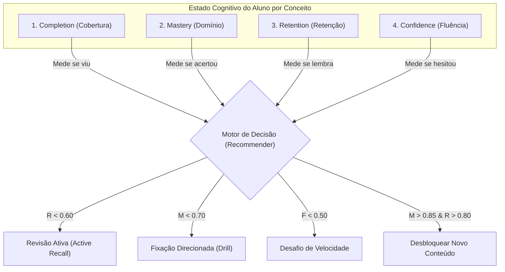
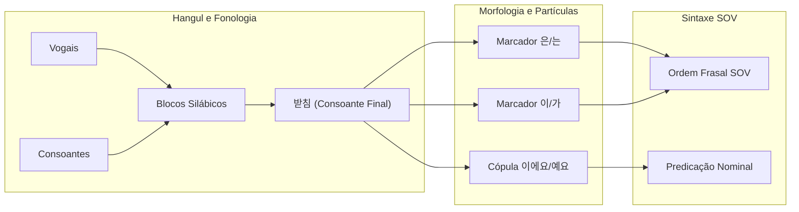

# Motor Adaptativo, IA Simbólica e Learning Engine

**Conceito Relacionado:** [[Neuropedagogia_e_Gamificacao]] | [[Desenvolvimento_Multiplataforma_Python]] | [[Design_System_e_Tokens_Semanticos]]  
**Documentos Vinculados:** [[decisao_arquitetural_motor_adaptativo_local_vs_llm]] | [[didactic_neuroscience_korean_ptbr]] | [[plano_ensino_implicito_neurociencia]] | [[implementation_plan]]  
**Código Fonte:** `src/models.py` (`MemoryNode`), `src/services.py` (`ProgressService`, `DataService`)  

---

## 1. 🧬 O Que é o Learning Engine do Sejong Companion?

O **Learning Engine** é o subsistema cognitivo local, determinístico e adaptativo responsável por transformar o Sejong Companion de um visualizador de conteúdo estático em um **tutor pessoal adaptativo**.

Diferente de abordagens genéricas baseadas em *Large Language Models* (LLMs), o motor é construído sobre os princípios da **IA Simbólica (Symbolic AI)**, **Knowledge Tracing** e **Modelagem Heurística de Memória Humana (Spaced Repetition / Decay Functions)**.

```
┌─────────────────────────────────────────────────────────────────────────────────────────────────┐
│                                CICLO DE APRENDIZAGEM ADAPTATIVA                                 │
├─────────────────────────────────────────────────────────────────────────────────────────────────┤
│                                                                                                 │
│    [ Currículo Sejong 1A ] ──► [ Exposição / Prática ] ──► [ Recuperação Ativa (Active Recall) ]│
│                 ▲                                                               │               │
│                 │                                                               ▼               │
│    [ Decisão Pedagógica ] ◄── [ Motor de Recomendação ] ◄── [ Nó de Memória (MemoryNode) ]      │
│                                                                                                 │
└─────────────────────────────────────────────────────────────────────────────────────────────────┘
```

---

## 2. 🔬 Os 4 Pilares Cognitivos

O sistema decompõe o estado de aprendizagem do aluno em quatro dimensões estritamente independentes (ortogonais):



### A. Completion (Cobertura Curricular — $K$)
- **Pergunta:** *"O aluno já foi exposto a este conteúdo?"*
- **Domínio:** Intervalo discreto ou contínuo $[0.0, 1.0]$.
- **Função:** Mede a progressão formal ao longo das 10 unidades do Sejong Hakdang 1A.

### B. Mastery (Taxa de Domínio — $M$)
- **Pergunta:** *"O aluno compreendeu a regra morfossintática e o vocabulário?"*
- **Cálculo:** Média móvel exponencial ponderada com amortecimento $\alpha = 0.25$:
  $$M_k = (1 - \alpha) M_{k-1} + \alpha S_k$$
- **Função:** Avalia a precisão sem misturar com o tempo de esquecimento. Uma regra aprendida com maestria mantém $M = 0.95$ mesmo que o aluno passe 2 meses sem revisar.

### C. Retention (Retenção Temporal — $R$)
- **Pergunta:** *"Qual a probabilidade de o aluno evocar este item hoje?"*
- **Cálculo:** Decaimento exponencial baseado na meia-vida acumulada $h$:
  $$R(t) = 2^{-\frac{\Delta t}{h}}$$
- **Função:** Aciona a fila de Active Recall quando $R < 0.75$.

### D. Confidence (Índice de Fluência Motora — $C$)
- **Pergunta:** *"A resposta foi automatizada (memória procedural) ou fruto de esforço deliberado/chute (declarativo)?"*
- **Cálculo:** Razão quadrática normalizada pelo tempo de referência do exercício:
  $$C = \frac{1}{1 + \left(\frac{T_{\text{ms}}}{T_{\text{ref}}}\right)^2}$$
- **Função:** Identifica quando um aluno acerta "por eliminação", recomendando reforço de velocidade antes do avanço.

---

### 🛡️ A Regra de Ouro: XP é Cosmético, Nunca Pedagógico

```text
┌─────────────────────────────────────────────────────────────────────────────┐
│  XP (Experiência)   │ MOTIVAÇÃO   │ Recompensa presença e disciplina (Streaks)│
├─────────────────────┼─────────────┼─────────────────────────────────────────┤
│  Mastery (Domínio)  │ APRENDIZAGEM│ Acurácia e compreensão conceitual real  │
├─────────────────────┼─────────────┼─────────────────────────────────────────┤
│  Retention (Meia-V.)│ MEMÓRIA     │ Estabilidade biológica e decaimento SRS │
├─────────────────────┼─────────────┼─────────────────────────────────────────┤
│  Completion (Trilha)│ PROGRESSO   │ Cobertura das 10 unidades do Sejong 1A  │
└─────────────────────────────────────────────────────────────────────────────┘
```

> [!CAUTION]
> **Por que o XP NUNCA deve entrar nas fórmulas de adaptação pedagógica:**
> 1. **Evita "Grinding" / Gaming the System:** O aluno não pode inflar seu nível pedagógico refazendo 50 vezes uma lição infantil para acumular XP.
> 2. **Impedimento da Falsa Maestria:** Um aluno com 10.000 XP (que estuda há 1 ano mas esqueceu a Unit 01) continuará recebendo alertas de retenção para a Unit 01. O motor respeita a biologia da memória ($R$), não o placar de pontos.
> 3. **Segurança Psicológica:** Errar exercícios não confisca XP. O erro alimenta $M$ e $R$ para ajuste didático, preservando a motivação emocional intacta.

---

## 3. 🗺️ O Learning Graph: Do Macro ao Micro

A arquitetura abandona notas médias por Unidade. O conhecimento é mapeado como um **Grafo Direcionado Acíclico (DAG)** de dependências:



### Resolução de Causa Raiz de Erro
Se o aluno erra a montagem da frase:
> `저는 학생예요` ❌ (Incorreto: `학생` possui 받침 `ㅇ`, exige `이에요`)

O motor não cataloga apenas "erro na Unit 01". Ele identifica a aresta de falha:
`[학생] (com 받침) ──► [이에요/예요 (Regra de Neutralização)]`.

O reforço sugerido não é reler a Unit 01 inteira, mas realizar **3 exercícios de fixação morfológica de terminação com e sem 받침**.

---

## 4. ⚡ Vantagens da IA Simbólica Local vs. LLMs em Nuvem

```
┌───────────────────────────────────────┬───────────────────────────────────────┐
│       MOTOR ADAPTATIVO LOCAL          │       IA GENERATIVA EM NUVEM          │
├───────────────────────────────────────┼───────────────────────────────────────┤
│ 🚀 0ms a 2ms de latência in-memory    │ ⏳ 1.500ms a 4.000ms de espera HTTP   │
│ 📴 100% Funcional Offline no celular  │ 🌐 Inutilizável sem Wi-Fi/4G ativo    │
│ 🔒 Zero vazamento de dados de aluno    │ ☁️ Telemetria enviada a servidores    │
│ 💰 Custo operacional zero             │ 💳 Custo por token consumido          │
│ 🎯 Zero risco de alucinação sintática │ ⚠️ Risco de explicar gramática errada │
│ 🧪 100% Determinístico e testável     │ 🎲 Comportamento estocástico instável │
└───────────────────────────────────────┴───────────────────────────────────────┘
```

---

## 5. 📌 Links de Navegação Obsidian
- 🧠 Central Mestre de Conceitos: [[INDICE_CONCEITOS]]
- 📋 Registro de Decisão Arquitetural: [[decisao_arquitetural_motor_adaptativo_local_vs_llm]]
- 🎮 Neuropedagogia e Gamificação: [[Neuropedagogia_e_Gamificacao]]
- 📱 Desenvolvimento Multiplataforma: [[Desenvolvimento_Multiplataforma_Python]]
- 🔬 Estudo Didático Contrastivo: [[didactic_neuroscience_korean_ptbr]]
