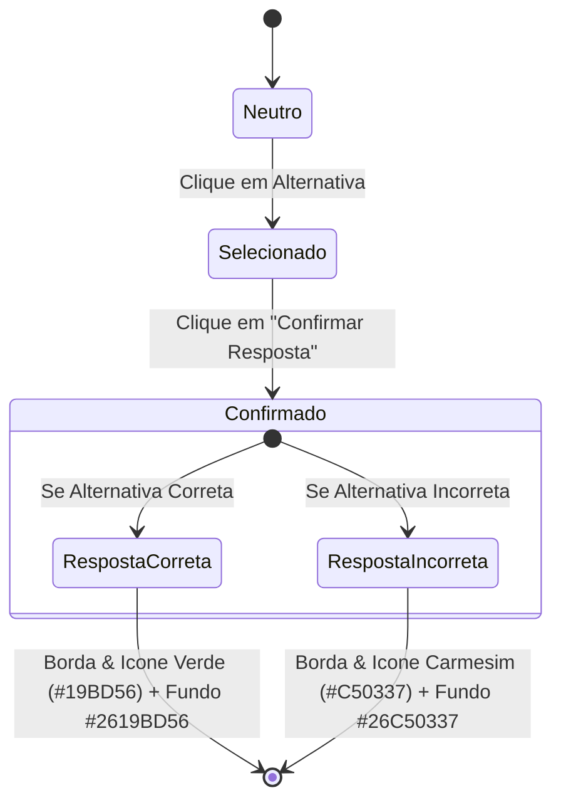

# Neuropedagogia, Gamificação e Ensino Implícito

**Conceito Relacionado:** [[Design_System_e_Tokens_Semanticos]] | [[Integracao_TTS_Typecast_e_Audio]] | [[Tipografia_Bilingue_e_CJK]]  
**Documentos Vinculados:** [[didactic_neuroscience_korean_ptbr]] | [[plano_ensino_implicito_neurociencia]] | [[viabilidade_app_coreano]] | [[viabilidade_sejong_companion]]  
**Bugs Catalogados:** [[bug_03_inversao_hex_alpha_aarrggbb_flet_flutter]]  

---

## 1. 🔬 Fundamentação Neurocientífica e Linguística Contrastiva

O aprendizado de uma língua oriental distante do Português Brasileiro (como o coreano, que possui estrutura sintática **SOV — Sujeito + Objeto + Verbo** e sistema de oclusivas tripartido) exige estratégias de interface voltadas à **redução de carga cognitiva** e à **eliminação total de avisos por escrito extrínsecos**.

```
[ Estrutura Sintática PT-BR (L1) ]                 [ Estrutura Sintática Coreano (L2) ]
SVO: Maria (S) lê (V) o livro (O).               SOV: 마리아가 (S) 책을 (O) 읽습니다 (V).
Ordem direta: Sujeito -> Verbo -> Objeto         Ordem invertida: Sujeito -> Objeto -> Verbo
```

---

## 2. 🧬 Teoria Neurocientífica Aplicada

### A. Teoria da Carga Cognitiva (Sweller, 1988)
A memória de trabalho humana (*Working Memory*) suporta apenas 3 a 5 elementos (*chunks*) simultâneos. Banners explicativos, disclaimers textuais e pop-ups de aviso consome recursos da memória de trabalho (*Extraneous Cognitive Load*), prejudicando a absorção do conteúdo real (*Germane Load*).

### B. Teoria da Codificação Dupla (Paivio, 1986)
O processamento concomitante de estímulos visuais (grafia Hangul / formas geométricas de conectores) e auditivos (áudio nativo HD) cria traços de memória redundantes no cérebro (verbais e não-verbais), aumentando a retenção em 200%.

### C. Memória Procedural vs. Declarativa na Linguagem (Ullman, 2004)
A gramática e a pronúncia fluentes dependem do **sistema procedural** (automático, inconsciente, localizado nos gânglios da base). Avisos por escrito forçam o aluno a recorrer ao **sistema declarativo** (temporal/hipocampal), criando a "muleta cognitiva" da tradução interna que paralisa a fala.

### D. Modelo de Memória Espaçada HLR (Settles & Meeder, arXiv:1606.01256)
Algoritmo de meia-vida da memória ($h$) baseado no histórico de recuperação ativa e latência de resposta para calcular o intervalo ideal de revisão de cada card sem estresse.

---

## 3. 🚫 A ABORDAGEM IMPLÍCITA: Eliminação de Avisos por Escrito

Para cumprir o requisito de **zero avisos por escrito / zero metadados textuais** dentro do aplicativo (removendo banners como `"🚫 Por que NÃO usamos romanização?"` e campos textuais `"neuro_tip"`), toda a pedagogia neurocientífica é traduzida para a **arquitetura de UX/UI, física de interações e feedback sensorial**.

```
┌────────────────────────────────────────────────────────────────────────────────┐
│                   MATRIZ DE SUBSTITUIÇÃO DO ENSINO IMPLÍCITO                   │
├──────────────────────────────┬─────────────────────────────────────────────────┤
│ Conceito Pedagogico          │ Substituição por Mecânica Sensorial Implícita   │
├──────────────────────────────┼─────────────────────────────────────────────────┤
│ Abolição da Romanização      │ Gating Áudio-Visual (som + onda luminosa instant)│
│ Aspiração/Tensão (ㄱ/ㅋ/ㄲ)   │ Pulso/Micro-vibração tátil e sopro visual       │
│ Sintaxe SOV (Ordem Verbo)    │ Drag-and-Drop com repulsão magnética de mola    │
│ Partículas 은/는 (Batchim)   │ Slots Morpho-Fonéticos (Square vs Round)        │
│ Honoríficos e Polidez        │ Aura Dourada no Avatar + Tom de Voz Respeitoso  │
│ Curva de Ebbinghaus          │ Anéis Orbi-Vital de Pulso de Energia (Home Map) │
└──────────────────────────────┴─────────────────────────────────────────────────┘
```

### 1. Gating Áudio-Visual para Abolição da Romanização
O aplicativo nunca exibe letras latinas ao apresentar consoantes ou vogais em Hangul. Ao tocar no caractere (ex: `ㅂ`), o som nativo é emitido instantaneamente acompanhado por um anel de luz expansivo. O cérebro associa o som /p/ diretamente à forma visual `ㅂ` sem passar pelo caractere intermediário `p`.

### 2. Drag-and-Drop Magnético de SOV (Física de Mola)
Ao montar frases em coreano:
- Se o usuário arrasta o bloco do Verbo para o meio da frase (ordem SVO do Português), o bloco sofre **repulsão física** e retorna à mão com animação de mola.
- O slot do final da frase é o único que possui polo magnético positivo que atrai o bloco do verbo. O aluno aprende a regra sintática pela sensação física de encaixe, sem ler regras escritas.

### 3. Encaixe Morpho-Fonético Visual (Partículas 받침)
- Palavras terminadas em consoante (com 받침, ex: `책`) possuem base quadrada que se encaixa exclusivamente no slot quadrado da partícula `은` ou `이`.
- Palavras terminadas em vogal (sem 받침, ex: `사과`) possuem base arredondada que desliza perfeitamente no slot arredondado da partícula `는` ou `가`.

---

## 4. 🎮 Máquina de Estados do Quiz & Semântica de Feedback

Para garantir que o erro seja tratado como aprendizado e não como punição, a interface do quiz implementa uma **máquina de estados em 3 fases**:



> **Aviso Importante de UX**: O botão de avanço ("Próxima Pergunta") permanece em Azul Sejong (`#0356C5`) ou Violeta (`#7C3AED`), nunca sendo pintado de vermelho para evitar que o usuário associe a ação de avançar com o erro cometido.

---

## 📌 Links de Navegação Obsidian
- 🧠 Central Mestre de Conceitos: [[INDICE_CONCEITOS]]
- 🧠 Estudo Didático Neuropedagógico: [[didactic_neuroscience_korean_ptbr]]
- 📋 Plano de Ensino Implícito: [[plano_ensino_implicito_neurociencia]]
- 🎨 Design System e Tokens: [[Design_System_e_Tokens_Semanticos]]
- 🚨 Bug das Cores de Quiz: [[bug_03_inversao_hex_alpha_aarrggbb_flet_flutter]]
