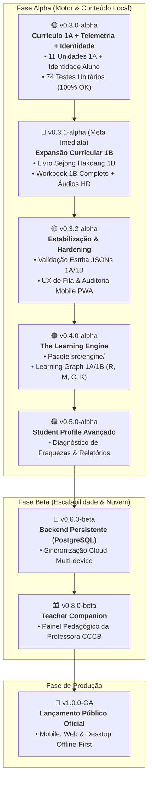

# 🗺️ Roadmap Mestre — Sejong Companion

**Status do Documento:** VIGENTE / BASELINE OFICIAL  
**Data de Atualização:** 2026-08-19  
**Documentos Vinculados:** [[decisao_arquitetural_motor_adaptativo_local_vs_llm]] | [[manifesto_estrategico_develop_vs_main]] | [[Motor_Adaptativo_e_Learning_Engine]] | [[CHANGELOG]]  

---

## 🧭 Visão Geral do Ciclo de Lançamentos

---

## 🟢 Fase 1: `v0.3.0-alpha` — Content & Memory Engine Baseline
> **Status:** CONCLUÍDO (Branch `develop`)

### Entregáveis Concluídos:
- [x] **Currículo Integral 1A:** 11 unidades didáticas JSON estruturadas (`unit_intro` + `unit_01` a `unit_10`).
- [x] **Arquitetura Data-Driven:** `DataService` genérico com validação via modelos Pydantic.
- [x] **Mecânica SOV com Validação Semântica:** Drag & Drop com papéis sintáticos e feedback elástico.
- [x] **Motor de Memória Temporal:** `MemoryNode` com modelo de meia-vida $R = 2^{-t/h}$.
- [x] **Dashboard de Active Recall & UX de Fila:** Rota `/review` com filtragem por threshold ($R < 75\%$) e estado proativo de "Revisão em Dia".
- [x] **Sistema de Evidência Pedagógica e Telemetria Local:** `TelemetryService`, `PedagogicalAnalyzer` e CLI `scripts.pedagogical_report` (100% anônimo e offline-first).
- [x] **Identidade Persistente do Aluno:** Suporte nativo a `page.client_storage` (localStorage / SharedPreferences) e export/import de backup JSON.
- [x] **Flashcards & Sentence Builder:** Módulo `/flashcards` com níveis de dificuldade e áudio HD.
- [x] **Suíte de Testes Automatizada:** 74 testes unitários com 100% de aprovação no `pytest`.

---

## 🔵 Fase 2: `v0.3.1-alpha` — Expansão Curricular: Livro 1B & Workbook 1B
> **Status:** CONCLUÍDO (Branch `develop`)  
> **Foco:** Inclusão de todo o conteúdo didático do Livro Sejong Hakdang 1B e seus respectivos exercícios de Workbook.

### Entregáveis Concluídos:
- [x] **Estruturação dos Dados do Livro 1B:** 12 unidades JSON completas (`unit_1b_01` a `unit_1b_12`) baseadas na edição oficial do King Sejong Institute 1B.
- [x] **Inclusão dos Exercícios de Workbook 1B:** Questões de múltipla escolha, ordenação de palavras e desafios sintáticos SOV Drag & Drop com papéis semânticos e rejeição elástica.
- [x] **Cadeia Contínua de Desbloqueio 1A → 1B:** Conexão contínua da `unit_10` para `unit_1b_01` até `unit_1b_12` no `ProgressService._UNLOCK_CHAIN`.
- [x] **Organização Visual na Home por Livro Didático:** Seções visuais `Sejong Coreano 1A` e `Sejong Coreano 1B` com badges `B1`–`B12` e orbes de retenção SRS.
- [x] **Expansão da Suíte de Testes Automatizada:** `tests/test_unit_1b_content.py` adicionado, elevando a suíte para **79 testes com 100% de aprovação**.

---

## 🟡 Fase 3: `v0.3.2-alpha` — Stabilization & Hardening
> **Status:** PLANEJADO (Meta Imediata)  
> **Foco:** Eliminação de pontas soltas, validação de integridade e refinamento de UX para toda a base 1A + 1B.

### Objetivos & Entregáveis Detalhados:
1. **Validação Estrita de Conteúdo (JSON Audit Global):**
   - Script automatizado de validação sintática para todos os arquivos de unidades 1A e 1B.
   - Garantir que todo item de vocabulário e questão SOV possua áudios pré-aquecidos e contratos semânticos válidos.
2. **Refinamento de UX nas Filas de Revisão e Trilha:**
   - Polimento das transições de visualização entre livros 1A e 1B no menu e na Home.
   - Ajustar textos e dicas visuais em telas com menos de 360px de largura.
3. **Auditoria de Responsividade Mobile / PWA:**
   - Validar viewport e gestos de toque no Chrome Mobile e Safari iOS.
   - Testar o comportamento do player de áudio sob bloqueio de autoplay no primeiro toque.
4. **Isolamento de Erros e Logs:**
   - Hardening no `ProgressService` contra arquivos de sessão corrompidos em disco.

### Critério de Aceite:
- 100% dos JSONs validados por schema Pydantic em teste automatizado contínuo.
- 0 regressões na suíte de testes.

---

## 🟠 Fase 3: `v0.4.0-alpha` — The Learning Engine
> **Status:** PLANEJADO  
> **Foco:** Implementação da IA Simbólica / Cognitiva Local conforme [[decisao_arquitetural_motor_adaptativo_local_vs_llm]].

### Objetivos & Entregáveis Detalhados:
1. **Criação do Pacote `src/engine/`:**
   - `src/engine/retention.py` — Curva de decaimento temporal $R(t)$ e atualização de meia-vida.
   - `src/engine/mastery.py` — Algoritmo de domínio cumulativo por média móvel exponencial ($M$).
   - `src/engine/confidence.py` — Índice de fluência motora calibrado pelo tempo de resposta ($C$).
   - `src/engine/scheduler.py` — Agendador priorizado de revisões ativas.
   - `src/engine/recommender.py` — Árvore de decisão determinística (O que estudar agora?).
   - `src/engine/graph.py` — Grafo de dependência curricular do Sejong 1A.
2. **Desacoplamento Arquitetural:**
   - Migrar cálculos matemáticos dispersos no `ProgressService` para a camada `src/engine/`.
   - As views do Flet apenas consom as recomendações da `LearningEngine` facade.
3. **Mapeamento do Learning Graph (Sejong 1A):**
   - Decomposição das 10 unidades em nós atômicos (Vogais, Consoantes, *받침*, Partículas `은/는`, `이/가`, `을/를`, `에/에서`, Cópula `이에요/예요`, etc.).
   - Rastreamento da causa raiz de erros sintáticos e fonológicos.

### Critério de Aceite:
- Módulo `src/engine/` com cobertura de testes unitários superior a 95%.
- Recomendador emitindo ações explicáveis (`LEARN_NEW`, `ACTIVE_RECALL`, `TARGETED_DRILL`, `FLUENCY_BOOST`).

---

## 🔵 Fase 4: `v0.5.0-alpha` — Student Profile & Evidence
> **Status:** PLANEJADO  
> **Foco:** Modelagem do perfil do estudante e telemetria pedagógica anônima.

### Objetivos & Entregáveis Detalhados:
1. **Student Profile Model:**
   - Estrutura de dados local registrando forças, fraquezas conceituais, velocidade média e horários de pico.
2. **Dashboard de Domínio Cognitivo:**
   - Visualização gráfica das 4 métricas (*Completion, Mastery, Retention, Confidence*) acessível ao aluno.
3. **Telemetria Pedagógica Local / Anônima:**
   - Registro de eventos (`PerformanceEvent`) para futura calibração estatística dos pesos de meia-vida.

---

## 🟣 Fase 5: `v0.6.0-beta` — Persistent Backend & Multi-User
> **Status:** PLANEJADO  
> **Foco:** Transição de sessão local para contas persistentes em nuvem.

### Objetivos & Entregáveis Detalhados:
1. **Banco de Dados Relacional (PostgreSQL):**
   - Migração de `data/sessions/{uuid}.json` para persistência robusta em nuvem.
2. **Autenticação e Perfil de Usuário:**
   - Sistema de login seguro com sincronização bidirecional Offline-First.
3. **Deploy em Produção (PWA + Mobile):**
   - Deploy cloud estável em ambiente com banco gerenciado.

---

## 🔴 Fase 6: `v0.8.0-beta` — Teacher Companion (CCCB)
> **Status:** PLANEJADO  
> **Foco:** Painel de apoio pedagógico para a professora do Centro Cultural Coreano.

### Objetivos & Entregáveis Detalhados:
1. **Teacher Dashboard:**
   - Visão agregada anônima do progresso da turma do Sejong Hakdang.
   - Identificação dos pontos de maior dificuldade coletiva (ex: confusão em números sino vs nativos).
2. **Intervenção Pedagógica Direcionada:**
   - Relatórios automáticos para guiar o planejamento das aulas presenciais.

---

## 🏆 Fase 7: `v1.0.0-GA` — General Availability
> **Status:** PLANEJADO  
> **Foco:** Lançamento público completo.

### Critérios Finais:
- 100% do currículo Sejong Hakdang 1A testado e validado por alunos reais do CCCB.
- Zero bugs críticos de layout, áudio ou persistência.
- Aplicativo leve, rápido e autônomo.
