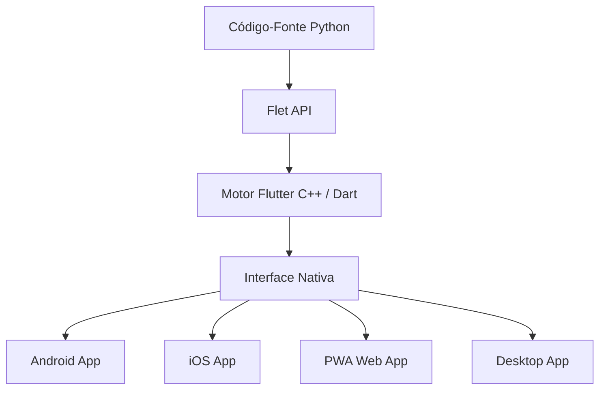

# 📊 Análise Detalhada: Stack Multiplataforma para o App Sejong Companion

Este documento apresenta uma análise técnica e estratégica da stack multiplataforma proposta nos documentos de viabilidade do **App Sejong Companion** (e do app comercial de coreano), que utiliza o framework **Flet (Python/Flutter)**.

---

## 1. Visão Geral da Stack Proposta

A stack centraliza o desenvolvimento em **Python**, utilizando o **Flet** como ponte para renderizar interfaces nativas por meio do motor do **Flutter**. O fluxo arquitetural se apoia em arquivos JSON para a entrega de conteúdo dinâmico (Lições, Vocabulário e Quizzes).



### Componentes Principais:
1. **Core UI/Logic:** `flet` (versão `>=0.25.0`)
2. **Audio & Media:** `flet-audio` (wrapper para `audioplayers` do Flutter)
3. **Data & Validation:** `pydantic` (estruturação de schemas JSON)
4. **Storage local:** Flet `client_storage` (armazenamento offline de progresso)

---

## 2. Análise Profunda da Tecnologia: Flet (Python + Flutter)

### Como funciona?
O Flet não traduz Python para Dart/Flutter. Em vez disso, ele executa um processo Python (ou servidor de desenvolvimento) que se comunica com uma aplicação Flutter compilada por meio de uma conexão segura (WebSockets/gRPC locais ou encapsulados). No celular, ele roda um interpretador Python embarcado que interage com os elementos da interface do Flutter.

### 2.1 Pontos Fortes (Vantagens)

*   **Curva de Aprendizado Acelerada:** Para o desenvolvedor solo do projeto (que já possui experiência com Python), elimina a necessidade de aprender Dart, JavaScript, Kotlin ou Swift.
*   **Single Codebase Real:** O mesmo código gera as versões mobile (APK/IPA), web (PWA) e desktop (Windows/macOS/Linux).
*   **Estética e Performance de Primeira Classe:** Como roda sobre o Flutter, a renderização gráfica usa aceleração por hardware (Impeller/Skia), garantindo animações fluidas a 60fps/120fps e acesso a uma biblioteca rica de mais de 150 componentes de design modernos.
*   **Ciclo de Desenvolvimento Rápido:** Possui suporte a *Hot Reload*, permitindo ver alterações de layout imediatamente.
*   **Roteamento e Estado Simplificados:** O controle de rotas e armazenamento local (`client_storage`) é nativo e simplificado em comparação ao ecossistema complexo do Flutter tradicional (Provider, Bloc, Riverpod).

### 2.2 Limitações e Desafios Críticos

*   **Tamanho do Pacote (Bundle Size):** Como o app precisa embarcar a máquina virtual do Python + a engine do Flutter, o tamanho mínimo de um APK/IPA fica em torno de **50MB a 80MB**, o que é consideravelmente maior que um app nativo puro (~10-15MB).
*   **Dependência de Wrappers:** Se um pacote nativo do Flutter (ex: detecção avançada de caligrafia por câmera, OCR avançado) não estiver envelopado pelo Flet, sua implementação exigirá a criação de pacotes customizados em Dart/C, o que desfaz a vantagem de usar apenas Python.
*   **Limitações de C-Extensions:** Bibliotecas Python que dependem fortemente de extensões em C/C++ (como NumPy, OpenCV ou Pandas) podem falhar ao serem compiladas para plataformas mobile devido a restrições de arquitetura de processador (ARM/x86).
*   **Necessidade de macOS para iOS Nativo:** Mesmo sendo cross-platform, a Apple exige o Xcode e um ambiente macOS para gerar a build final (`.ipa`) e enviar para a App Store.

---

## 3. Comparativo de Stacks Multiplataforma

Para validar a escolha do **Flet**, abaixo está um comparativo entre as stacks multiplataforma mais relevantes no mercado de desenvolvimento EdTech atual:

| Critério | Flet (Python) | Flutter (Dart) | React Native (JS/TS) | Kotlin Multiplatform (KMP) | Progressive Web App (PWA) |
| :--- | :--- | :--- | :--- | :--- | :--- |
| **Linguagem** | Python | Dart | JavaScript / TypeScript | Kotlin | HTML, CSS, JavaScript |
| **Curva de Aprendizado** | 🟢 Muito Baixa (p/ quem sabe Python) | 🟡 Média (nova sintaxe) | 🟡 Média (p/ devs Web/React) | 🔴 Alta (iOS/Android nativo) | 🟢 Muito Baixa |
| **Performance Visual** | 🟢 Alta (60fps via Flutter) | 🟢 Excelente (Nativa) | 🟡 Boa (Ponte JS) | 🟢 Excelente (Nativa) | 🟡 Média (depende do Browser) |
| **Tamanho da Build** | 🔴 Grande (50-80MB) | 🟡 Médio (15-25MB) | 🟡 Médio (20-30MB) | 🟢 Pequeno (10-15MB) | 🟢 Irrelevante (< 2MB) |
| **Acesso a APIs Nativas** | 🟡 Limitado a wrappers | 🟢 Completo | 🟢 Amplo | 🟢 Total | 🔴 Muito Limitado |
| **Custo de Infra (iOS)** | 🟡 Requer Mac p/ App Store | 🟡 Requer Mac p/ App Store | 🟡 Requer Mac p/ App Store | 🟡 Requer Mac p/ App Store | 🟢 **Zero** (roda em qualquer browser) |

### 💡 Análise Comparativa Estratégica:
1. **Flet** é imbatível para o cenário de **MVP, Dev Solo e tempo limitado**, pois aproveita a familiaridade do desenvolvedor com Python sem comprometer a qualidade da UI.
2. **Flutter (Nativo)** seria a evolução natural caso o projeto precise escalar comercialmente, necessitando de arquivos menores de download e integrações nativas profundas (como reconhecimento de voz e escrita avançados).
3. **PWA (via Flet Web)** surge como a **melhor rota de mitigação** para atingir usuários de iPhone (iOS) sem a necessidade de adquirir um Mac ou pagar a taxa de USD 99/ano da Apple Developer Program no início.

---

## 4. Análise de Arquitetura Proposta

O plano de implementação sugere uma arquitetura modular muito bem definida, excelente para manter a manutenibilidade do app a longo prazo por um dev solo.

```
├── data/              # Dados estáticos desacoplados (JSON)
├── src/
│   ├── components/    # UI Reutilizável (Hangul cards, quiz engines)
│   ├── views/         # Telas (Home, Módulo Hangul, Exercícios)
│   ├── services/      # Lógica de negócio (Audio, Progresso, JSON Loader)
│   └── models/        # Schemas de dados estruturados (Pydantic)
```

### Análise do Modelo JSON-Driven (Orientado a Dados)
O uso de arquivos JSON estruturados para vocabulários e exercícios é uma **excelente decisão de design**:
- **Desacoplamento:** Permite alterar o conteúdo pedagógico (corrigir erros gramaticais ou adicionar palavras) sem mexer no código-fonte de lógica de interface.
- **Portabilidade:** Caso no futuro a stack precise migrar para Flutter nativo (Dart) ou React Native, a lógica de dados (JSON) continuará 100% idêntica.
- **Offline-First facilitado:** Como os dados residem localmente na pasta `data/`, o app funciona em modo avião sem problemas de conectividade.

---

## 5. Recomendações e Próximas Ações

> [!TIP]
> **Recomendação de Deploy:** Iniciar distribuindo o **APK diretamente para Android** no grupo de alunos do CCCB, e paralelamente publicar o **PWA via GitHub Pages/Vercel (gratuito)** para os alunos de iOS (iPhone). Isso contorna a barreira do Mac/Apple Developer Account.

> [!WARNING]
> **Copyright da KSIF:** A análise dos documentos deixa claro que o conteúdo do livro 세종한국어 é protegido. A stack em Python deve focar em carregar dados customizados no JSON (`curriculum.json`), mudando textos e exercícios para que sejam **explicativos e complementares**, evitando a cópia literal dos Workbooks oficiais.

### Matriz de Decisão para Próximos Passos:

```mermaid
decision-matrix
  "Necessidade de Internet" 
    --> "Offline-First (Recomendado)" --> "Guardar JSONs locais em assets/"
    --> "Online / Dashboard Prof." --> "Implementar backend em Python (FastAPI + SQLite)"
  "Acesso a MacOS"
    --> "Não" --> "Compilar Web/PWA e disponibilizar link para iOS"
    --> "Sim" --> "Compilar IPA e distribuir via TestFlight (Beta)"
```

---
> **Elaborado com base nos documentos:** [viabilidade_sejong_companion.md](file:///c:/Users/Pichau/Documents/app%20sejong%20companion/viabilidade_sejong_companion.md), [viabilidade_app_coreano.md](file:///c:/Users/Pichau/Documents/app%20sejong%20companion/viabilidade_app_coreano.md) e [implementation_plan.md](file:///c:/Users/Pichau/Documents/app%20sejong%20companion/implementation_plan.md).
