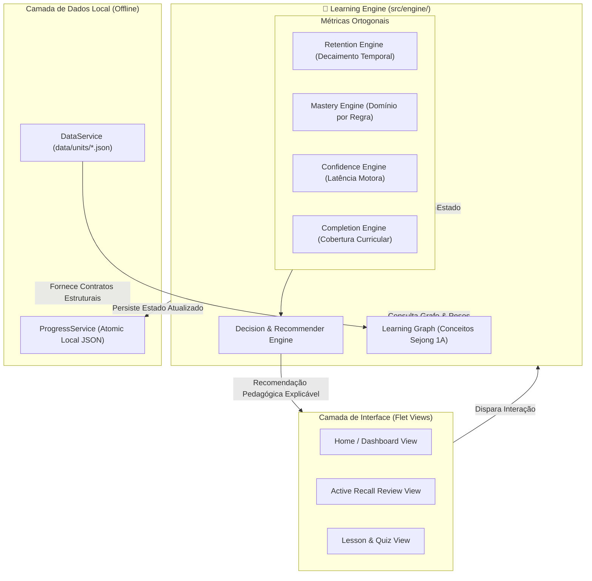
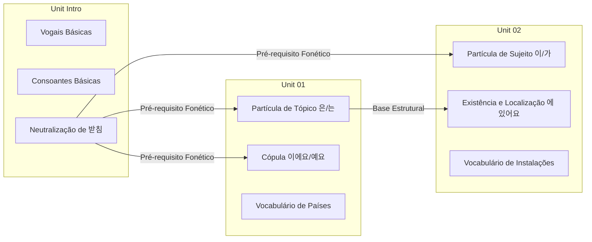

# ADR-001: Motor Adaptativo Local (Cognitive Learning Engine) vs. IA Generativa (LLM)

**Status:** APROVADO / BASELINE TÉCNICO  
**Data da Decisão:** 2026-08-19  
**Versão Alvo:** `0.4.0-alpha`  
**Conceito Relacionado:** [[Motor_Adaptativo_e_Learning_Engine]] | [[Neuropedagogia_e_Gamificacao]] | [[Desenvolvimento_Multiplataforma_Python]]  
**Documentos Vinculados:** [[analise_stack_multiplataforma]] | [[implementation_plan]] | [[didactic_neuroscience_korean_ptbr]]  

---

## 1. Contexto e Problema de Engenharia

Com a evolução da branch `develop` (marco `0.3.0-alpha`), o **Sejong Companion** deixou de ser um visualizador estático de lições e começou a transicionar para um **sistema adaptativo de aprendizagem**.

A introdução de nós de memória temporal ([`MemoryNode`](file:///c:/Users/Pichau/Documents/sejong_companion/src/models.py#L195-L245)), sessões de recuperação ativa ([`ReviewSessionState`](file:///c:/Users/Pichau/Documents/sejong_companion/src/models.py#L267-L274)), papéis sintáticos estritos para SOV ([`SovSlotDefinition`](file:///c:/Users/Pichau/Documents/sejong_companion/src/models.py#L83-L138)) e dados curriculares estruturados (Unidades 00 a 10) levantou uma questão de design arquitetural de alto nível:

> **Pergunta Decisória:** O Sejong Companion deve integrar modelos de linguagem de grande porte (LLMs / IA Generativa via API em nuvem) para gerar feedbacks dinâmicos e conversações, ou deve construir um **motor adaptativo local, determinístico e simbólico (Learning Engine)** operando inteiramente no dispositivo do usuário?

---

## 2. Análise Comparativa e Fria de Trade-Offs

Uma avaliação puramente analítica dos vetores de viabilidade técnica, produto e pedagogia demonstra a inviabilidade de LLMs para o perfil do Sejong Companion (App Mobile Leve, Flet/Python, foco no público lusófono aprendendo Sejong Hakdang 1A):

```
┌──────────────────────────────────────────────────────────────────────────────────────────────────┐
│                               MATRIZ COMPARATIVA DE ARQUITETURA                                  │
├──────────────────────────────┬──────────────────────────────────┬────────────────────────────────┤
│ Dimensão Analítica           │ IA Generativa em Nuvem (LLM)     │ Motor Cognitivo Local          │
├──────────────────────────────┼──────────────────────────────────┼────────────────────────────────┤
│ 1. Latência de Resposta      │ 1.000ms a 4.500ms (HTTP/TLS)     │ < 2ms (Operações O(1) in-RAM)  │
│ 2. Dependência de Rede       │ Bloqueante (Falha total offline) │ Nula (100% Offline-First)      │
│ 3. Custo Operacional ($)     │ Marginal por token/aluno/mês     │ R$ 0,00 fixo e perpétuo        │
│ 4. Consumo de Bateria/CPU    │ Alto (Networking frequente)      │ Desprezível (Aritmética básica)│
│ 5. Risco de Alucinação       │ Presente (Erros em gramática)    │ Zero (Contrato Pydantic/JSON)  │
│ 6. Explicabilidade           │ Caixa-preta probabilística       │ 100% Determinístico/Auditável  │
│ 7. Privacidade de Dados      │ Envio de telemetria a terceiros  │ Dados restritos ao dispositivo │
│ 8. Testabilidade Automatizada│ Estocástica / Flaky tests        │ 100% Reprodutível em Pytest    │
└──────────────────────────────┴──────────────────────────────────┴────────────────────────────────┘
```

### 2.1. O Risco Crítico da Alucinação Gramatical no Coreano
O coreano possui um sistema estrito de partículas gramaticais condicionadas fonologicamente (ex: `은/는`, `이/가`, `을/를`, `이에요/예요`) dependentes da presença ou ausência de consoante final (*받침 - batchim*). 

Modelos de linguagem estatísticos cometem desvios sutis de partículas e níveis de fala (* 존댓말 vs 반말 *) em contextos sintáticos limítrofes. Em um aplicativo pedagógico normativo baseado no currículo oficial do **Instituto Sejong**, qualquer feedback incorreto gera desaprendizagem sistemática no estudante lusófono.

### 2.2. A Falácia da IA Generativa como "Diferencial de Produto"
Adicionar chamadas a endpoints como OpenAI/Anthropic/Gemini para tarefas que podem ser resolvidas por grafos de dependência e modelos de retenção cria dependência externa desnecessária, vulnerabilidade a quebra de API, lentidão na UI e custos recorrentes, sem agregar precisão pedagógica superior.

---

## 3. A Decisão Arquitetural e Veredito

> [!IMPORTANT]
> ### 🎯 Resposta Oficial à Pergunta Decisória:
> **Deve-se construir um motor adaptativo local, determinístico e simbólico (Learning Engine) operando inteiramente no dispositivo do usuário.**
>
> Fica formalmente vetada a utilização de IA Generativa (LLMs) em tempo de execução no Sejong Companion. Toda a adaptação pedagógica será regida por modelos matemáticos in-memory, grafos de conhecimento e heurísticas de retenção executadas 100% no cliente.



---

## 4. O Modelo Matemático e Simbólico

Para substituir a necessidade de predições heurísticas difusas, o motor opera com **quatro métricas ortogonais e desacopladas**:

### 4.1. Curva de Retenção e Esquecimento ($R$) — *Memória Temporal*
Modela a probabilidade de evocação de um item no instante atual $t$, dado o histórico de revisões e a meia-vida acumulada $h$:

$$R(t) = 2^{-\frac{\Delta t}{h}}$$

Onde:
- $\Delta t$: Tempo decorrido desde a última recuperação ativa (em dias).
- $h$: Meia-vida da memória (em dias), atualizada a cada interação.

> **Ressalva Epistemológica Obrigatória:** A implementação atual é classificada tecnicamente como um **modelo heurístico determinístico de decaimento exponencial**, e não como um algoritmo estatístico empírico treinado sobre grandes bases populacionais. O projeto abstém-se deliberadamente de alegar validação neurocientífica clínica estrita até a futura coleta e calibração de dados anônimos de interação real.

### 4.2. Domínio Cumulativo ($M$) — *Consistência de Aprendizagem*
Calcula a taxa de domínio estrutural de um conceito independente do tempo de esquecimento, através de suavização exponencial ponderada (*Exponential Moving Average*):

$$M_{k} = (1 - \alpha) \cdot M_{k-1} + \alpha \cdot S_{k}$$

Onde:
- $S_k \in [0.0, 1.0]$: Score obtido no exercício $k$.
- $\alpha = 0.25$: Fator de amortecimento que previne que um único erro ocasional destrua o histórico de domínio, ou que um chute correto finja maestria.

### 4.3. Confiança e Automatização ($C$) — *Fluência e Latência Motora*
Diferencia acertos automáticos (memória procedural consolidada) de acertos hesitantes (busca declarativa lenta):

$$C = \frac{1}{1 + \left(\frac{T_{\text{resposta}}}{T_{\text{referência}}}\right)^2}$$

Onde:
- $T_{\text{resposta}}$: Tempo de resposta registrado em milissegundos.
- $T_{\text{referência}}$: Limite normativo para a complexidade do exercício (ex: 2.500ms para vocabulário simples, 6.000ms para unscrambling SOV).

### 4.4. Cobertura Curricular ($K$) — *Progresso Linear*
Taxa simples de completude de lições e exposições aos blocos formais do Sejong Hakdang 1A:

$$K = \frac{\sum \text{unidades\_concluídas}}{\text{total\_unidades}}$$

---

## 5. Learning Graph: Desagregação por Conceitos Atômicos

A inteligência do sistema abandona o modelo unidimensional de "nota por unidade" em favor de um **Grafo de Dependência de Conceitos (Learning Graph)**:



Se o estudante apresenta sucessivas falhas na terminação `예요` na Unidade 01, o motor localiza o nó falho no grafo: **não é a Unidade 01 como um todo, mas sim a regra de ausência de 받침 oriunda da Unit Intro**. A recomendação gerada atinge a raiz fonética do problema.

---

## 6. Arquitetura Modular Alvo (`src/engine/`)

Para a versão `0.4.0-alpha`, os cálculos atualmente concentrados no `ProgressService` e `models.py` serão modularizados no pacote `src/engine/`:

```text
src/engine/
├── __init__.py              # Exporta a facade LearningEngine
├── models.py                # Contratos Pydantic: ConceptState, Recommendation, PerformanceEvent
├── graph.py                 # Grafo estático de dependências do Sejong 1A (Unidades 00 a 10)
├── retention.py             # Cálculo e atualização da meia-vida (HLR Heurístico)
├── mastery.py               # Algoritmo de suavização exponencial de domínio
├── confidence.py            # Normalização de latência e índice de hesitação
├── scheduler.py             # Fila priorizada de Active Recall (Threshold R < 0.75)
└── recommender.py           # Árvore de decisão pedagógica determinística
```

### Contrato de Decisão Pedagógica (Exemplo de Implementação)
```python
class PedagogicalAction(str, Enum):
    LEARN_NEW = "learn_new"
    ACTIVE_RECALL = "active_recall"
    TARGETED_DRILL = "targeted_drill"
    FLUENCY_BOOST = "fluency_boost"
    ADVANCE = "advance"

class RecommenderEngine:
    @staticmethod
    def evaluate(concept: ConceptState) -> Recommendation:
        if concept.completion < 1.0:
            return Recommendation(
                action=PedagogicalAction.LEARN_NEW,
                reason="Conteúdo curricular ainda não explorado."
            )
        if concept.retention < 0.60:
            return Recommendation(
                action=PedagogicalAction.ACTIVE_RECALL,
                reason=f"Retenção estimada caiu para {concept.retention:.0%}. Risco de esquecimento."
            )
        if concept.mastery < 0.70:
            return Recommendation(
                action=PedagogicalAction.TARGETED_DRILL,
                reason=f"Taxa de erro recente elevada ({1 - concept.mastery:.0%}). Reforço de regra recomendado."
            )
        if concept.confidence < 0.50:
            return Recommendation(
                action=PedagogicalAction.FLUENCY_BOOST,
                reason="Conceito dominado, mas com tempo de resposta elevado. Prática de velocidade recomendada."
            )
        return Recommendation(
            action=PedagogicalAction.ADVANCE,
            reason="Conceito consolidado na memória e na fluência."
        )
```

---

## 7. Consequências da Decisão

### Positivas:
1. **Autonomia Operacional Máxima:** O aplicativo opera integralmente em modo avião/offline.
2. **Performance Instantânea:** Nenhuma operação de decisão excede 5ms no dispositivo móvel.
3. **Custo Marginal Zero:** Nenhuma despesa recorrente de API para manutenção da inteligência.
4. **Segurança e Confiabilidade Pedagógica:** As regras gramaticais e sintáticas coreanas são 100% determinísticas e blindadas contra desvios.
5. **Propriedade Intelectual Reutilizável:** O motor cognitivo do Sejong Companion torna-se um ativo de software próprio e auditável.

### Limitações e Mitigações:
1. *Limitação:* O sistema não gera diálogos em linguagem natural aberta e irrestrita.
   - *Mitigação:* O escopo do Sejong 1A é formativo e estrutural (Hangul, vocabulário base, partículas e conjugação regular). Desafios de montagem sintática (Drag-and-Drop SOV com validação de papéis) são pedagogicamente superiores a chats abertos nesse estágio.
2. *Limitação:* O modelo de retenção é inicialmente uma aproximação heurística.
   - *Mitigação:* Estruturar telemetria local/anônima de eventos (`PerformanceEvent`) para calibração futura dos multiplicadores de estabilidade com base em dados de uso real.

---

## 8. Cronograma de Engenharia e Roadmap

```text
  0.3.0-alpha (Baseline)  ──►  0.3.1-alpha (Livro 1B)   ──►  0.3.2-alpha (Hardening)  ──►  0.4.0-alpha (Engine)
  • 11 Unidades (1A)           • Currículo Sejong 1B         • Validação estrita JSONs     • Pacote src/engine/
  • Telemetria Local           • Exercícios Workbook 1B      • Responsividade Mobile/PWA   • Métricas (R, M, C, K)
  • Identidade Aluno           • Áudio TTS HD expandido      • Polimento UX de Fila        • Grafo 1A + 1B
  • 74 Testes OK               • Desbloqueio 1A → 1B         • Cobertura de Testes         • Agendador Adaptativo
```
