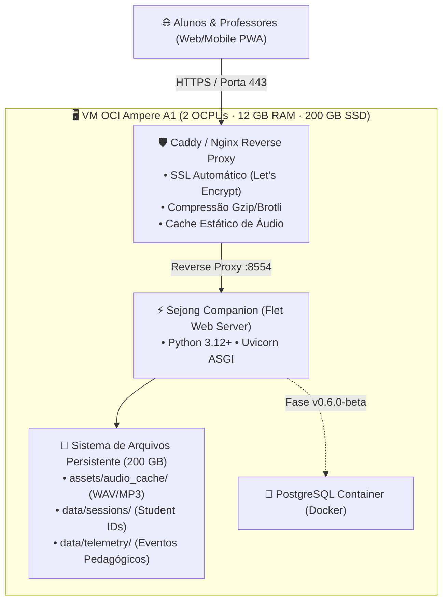

# ☁️ Estratégia de Hospedagem: Oracle Cloud Always Free (ARM Ampere) vs. Render

**Status do Documento:** VIGENTE / PLANEJAMENTO DE DEPLOY BETA  
**Data:** 2026-08-20  
**Contexto:** Definição da infraestrutura de hospedagem em nuvem para a versão Web/PWA do **Sejong Companion**, backend de sincronização (`v0.6.0-beta`) e Painel Pedagógico do Professor (`v0.8.0-beta`).

---

## 1. Comparativo Técnico de Infraestrutura Gratuita

| Recurso / Critério | Render (Free Tier Web Service) | Oracle Cloud Infrastructure (OCI Always Free ARM Ampere) | Impacto no Sejong Companion |
| :--- | :--- | :--- | :--- |
| **Arquitetura & CPU** | 0.1 vCPU compartilhada | **Até 4 OCPUs (ARM64 Ampere A1)** *(ou 2 OCPUs dedicadas por VM)* | Inicialização instantânea do runtime Flet/Python e recálculo ágil dos nós SRS. |
| **Memória RAM** | 512 MB | **Até 24 GB de RAM** *(ou 12 GB por VM)* | Capacidade para suportar dezenas de conexões concorrentes de alunos e WebSockets sem OOM (*Out of Memory*). |
| **Armazenamento** | Efêmero (apagado no reinício) | **200 GB Block Storage Persistente** | **Crítico:** Preserva em disco 100% dos áudios HD (WAV/MP3), sessões de alunos (`data/sessions/`) e logs de telemetria sem exigir S3 pago. |
| **Disponibilidade / Uptime** | Hiberna após 15 min de inatividade | **24/7 Always-On (Sem hibernação)** | Elimina o *cold start* de 50-90s do Render. Alunos e professores acessam instantaneamente (0ms de espera). |
| **Limite Mensal de Horas** | 750 horas/mês (1 instância) | **Ilimitado (Gratuito para sempre)** | Permite manter o servidor ativo 30 dias por mês ininterruptamente. |
| **Tráfego de Saída** | 100 GB/mês | **10 TB/mês** | Margem gigantesca para streaming de áudios fonéticos coreanos sem custo adicional. |
| **Controle de Sistema Operacional** | PaaS fechado (Docker container) | **VPS Linux Dedicado (Ubuntu / Oracle Linux ARM)** | Liberdade para configurar Nginx/Caddy, Docker Compose, PostgreSQL e certificado SSL automático Let's Encrypt. |

---

## 2. Por que o OCI Always Free é a Escolha Ideal para o Sejong Companion?

### 1. Persistência de Dados Sem Custo Adicional
No Render ou Heroku gratuitos, qualquer reinicialização do container apaga arquivos locais. Como o Sejong Companion armazena:
- Cache de Áudios HD Typecast (`assets/audio_cache/`)
- Sessões de Alunos (`data/sessions/student_*.json`)
- Logs de Evidência Pedagógica (`data/telemetry/pedagogical_events.jsonl`)

Os **200 GB de disco persistente** da Oracle garantem que nenhum dado de aprendizagem ou áudio seja perdido, mesmo sem um banco de dados externo ou bucket S3 pago.

### 2. Zero Cold Start para Alunos e Professores
No plano gratuito do Render, quando o professor tenta abrir o painel `/admin` ou um aluno acessa o link na aula do CCCB, o container leva de 50 a 90 segundos para acordar (*cold start*), gerando uma péssima experiência de uso. No OCI, o app roda continuamente como um serviço *daemon* (*systemd* ou *Docker*).

### 3. Suporte Nativo a ARM64 (Ampere)
O ecossistema Python 3.12+, Flet e Flutter possui compilação e suporte binário de alto desempenho para arquiteturas ARM64 (`aarch64`), operando com consumo elétrico ultra-baixo e alta densidade de processamento.

---

## 3. Arquitetura de Deploy Proposta na OCI

---

## 4. Roteiro de Provisionamento OCI (Guia Rápido)

1. **Criar Conta no Oracle Cloud Free Tier:**
   - Selecionar a Home Region mais próxima (ex: `São Paulo - Brazil East` ou `Ashburn - US East`).
2. **Provisionar Instância Compute VM.Standard.A1.Flex:**
   - Imagem: `Ubuntu 24.04 LTS (AArch64)`.
   - OCPUs: 2 a 4.
   - Memória: 12 GB a 24 GB.
   - Disco de Inicialização: 100 GB a 200 GB.
3. **Configurar Security List (VCN):**
   - Liberar portas Ingress: `80 (HTTP)`, `443 (HTTPS)`.
4. **Instalar Docker & Docker Compose:**
   - Subir o container da aplicação com `docker-compose.yml` mapeando volume persistente.
5. **Configurar Domínio & SSL:**
   - Apontar DNS (ex: `sejong.seudominio.com` ou IP público reservado gratuito).
