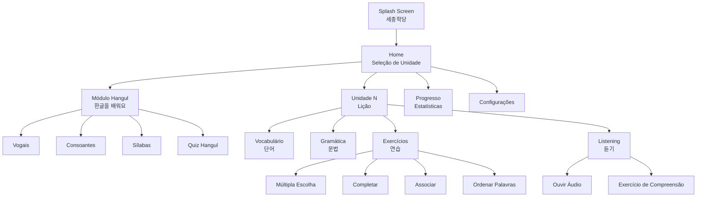

# Plano de Implementação: App Sejong Hakdang CCCB

App mobile de estudo de coreano para alunos do Sejong Hakdang / Centro Cultural Coreano no Brasil, feito com **Flet (Python)** para iOS e Android.

---

## Contexto

- **Solicitante:** Professora de coreano do CCCB
- **Desenvolvedor:** Aluno da turma (dev solo)
- **Público:** Alunos do Sejong Hakdang no Brasil
- **Conteúdo base:** Textbook + Workbook 세종한국어 1A (lições e exercícios)
- **Áudio:** Typecast.ai (TTS coreano com voz natural) — substitui os áudios da professora
- **Copyright:** Uso do material Sejong autorizado expressamente pela professora do CCCB
- **Níveis:** 1 (MVP), expandível para 2 e 3
- **Stack:** Python + Flet (Flutter por baixo → iOS + Android + Web)
- **Sem prazo definido** — ritmo do desenvolvedor

---

## User Review Required

> [!IMPORTANT]
> **Decisões que preciso da sua confirmação antes de começar:**

### 1. Nome do App
Precisamos de um nome. Sugestões:
- **세종 학습 (Sejong Haksseup)** — "Estudo Sejong"
- **한글 길 (Hangul Gil)** — "Caminho do Hangul"
- **세종 컴패니언 (Sejong Companion)**
- Ou um nome que a professora/turma já tenham em mente?

### 2. Conteúdo dos Livros
- Você tem o textbook e workbook 1A em formato **digital (PDF)** ou só **físico**?
- Se for físico, precisaremos digitalizar o conteúdo manualmente (lição por lição) para transformar em dados estruturados (JSON/banco de dados)
- ~~Os áudios estão em que formato?~~ → **Resolvido:** Usaremos Typecast.ai para gerar áudios TTS em coreano

### 3. Escopo do MVP — Proposta
Sugiro começar com estas funcionalidades para o MVP (detalhadas abaixo). Concorda?
- ✅ Módulo Hangul (aprender o alfabeto)
- ✅ Lições baseadas no Workbook 1A (vocabulário + gramática)
- ✅ Exercícios interativos (quiz, completar, associar)
- ✅ Player de áudio para listening
- ✅ Progresso do aluno (salvo localmente)

### 4. Deploy
- **Android:** Distribuir como APK direto (WhatsApp/grupo) ou publicar na Play Store?
- **iOS:** Você tem acesso a um Mac para buildar? E conta Apple Developer (USD 99/ano)?
- **Alternativa:** Build como **PWA web** (funciona nos dois sem loja) — mais simples para distribuir

---

## Open Questions

> [!WARNING]
> **Questões técnicas que impactam a arquitetura:**

1. **Offline-first?** — Os alunos precisam usar o app sem internet? Se sim, todo conteúdo precisa ser empacotado no app. Se não, podemos usar um backend leve.
2. **Dashboard para professora?** — A professora quer ver o progresso dos alunos? Isso exigiria um backend/servidor.
3. **Atualizações de conteúdo** — Quando novos níveis forem adicionados (1B, 2A), como distribuir? Update do app ou download dinâmico?
4. ~~**Licenciamento do conteúdo**~~ → **Resolvido:** A professora do CCCB autorizou expressamente o uso do conteúdo do Textbook e Workbook 세종한국어 no app, mesmo com os avisos de copyright. O material é do governo coreano e será usado apenas como ferramenta de estudo complementar para os alunos da turma.

---

## Proposed Changes

### Estrutura do Currículo (Sejong Korean 1A)

O app seguirá a estrutura oficial do Textbook + Workbook 1A (edição 2022):

| Unidade | Título (한국어) | Tema | Conteúdo Principal |
|:---|:---|:---|:---|
| Intro | 한글을 배워요 | Hangul | Vogais, consoantes, sílabas |
| 01 | 안녕하세요? 저는 안나예요 | Apresentação | Cumprimentos, 이에요/예요 |
| 02 | 전화번호가 뭐예요? | Informações | Números, partículas 이/가 |
| 03 | 제 가방은 책상 옆에 있어요 | Localização | 있다/없다, posições |
| 04 | 한국어를 공부해요 | Rotina | Verbos de ação, 을/를 |
| 05 | 빵하고 우유를 사요 | Compras | 하고, vocabulário de comida |
| 06 | 사과 다섯 개 주세요 | Quantidades | Contadores, números sino-coreanos |
| 07 | 일곱 시에 시작해요 | Horários | Horas, 에 (tempo) |
| 08 | 날씨가 더워요? | Clima | Adjetivos, interrogativas |
| 09 | 공원에서 산책했어요 | Passado | Tempo passado -았/었어요 |
| 10 | 우리 같이 놀이공원에 갈까요? | Planos | Propostas -(으)ㄹ까요? |

---

### Arquitetura do App

```
sejong-app/
├── assets/
│   ├── icon.png                    # Ícone do app
│   ├── fonts/                      # Fontes coreanas (Noto Sans KR)
│   ├── audio/                      # Áudios TTS gerados via Typecast.ai
│   │   ├── unit_01/
│   │   ├── unit_02/
│   │   └── ...
│   └── images/                     # Ilustrações das lições
│
├── data/
│   ├── curriculum.json             # Estrutura do currículo (unidades, lições)
│   ├── vocabulary/                 # Vocabulário por unidade
│   │   ├── unit_01.json
│   │   └── ...
│   ├── grammar/                    # Regras gramaticais por unidade
│   │   ├── unit_01.json
│   │   └── ...
│   └── exercises/                  # Exercícios por unidade
│       ├── unit_01.json
│       └── ...
│
├── src/
│   ├── components/                 # Componentes reutilizáveis
│   │   ├── hangul_card.py          # Card de caractere Hangul
│   │   ├── vocab_card.py           # Card de vocabulário
│   │   ├── audio_player.py         # Player de áudio (TTS via Typecast.ai)
│   │   ├── quiz_widget.py          # Widget de quiz genérico
│   │   ├── progress_bar.py         # Barra de progresso
│   │   └── nav_bar.py              # Navegação inferior
│   │
│   ├── views/                      # Telas do app
│   │   ├── splash_view.py          # Tela de abertura
│   │   ├── home_view.py            # Tela inicial (seleção de unidade)
│   │   ├── hangul_view.py          # Módulo de Hangul
│   │   ├── lesson_view.py          # Tela de lição (vocab + gramática)
│   │   ├── exercise_view.py        # Tela de exercícios
│   │   ├── listening_view.py       # Player de áudio + exercícios
│   │   ├── progress_view.py        # Tela de progresso geral
│   │   └── settings_view.py        # Configurações
│   │
│   ├── services/                   # Lógica de negócio
│   │   ├── data_service.py         # Carrega dados JSON
│   │   ├── progress_service.py     # Gerencia progresso (client_storage)
│   │   ├── audio_service.py        # Controla reprodução de áudio (Typecast.ai TTS)
│   │   └── quiz_engine.py          # Motor de exercícios/quizzes
│   │
│   ├── models/                     # Modelos de dados
│   │   ├── unit.py                 # Modelo de Unidade
│   │   ├── vocabulary.py           # Modelo de Vocabulário
│   │   ├── grammar.py              # Modelo de Gramática
│   │   ├── exercise.py             # Modelo de Exercício
│   │   └── user_progress.py        # Modelo de Progresso
│   │
│   ├── theme.py                    # Cores, fontes, estilos globais
│   └── router.py                   # Roteamento entre telas
│
├── main.py                         # Entry point
├── requirements.txt                # Dependências
└── README.md
```

---

### Componentes e Telas

#### [NEW] `main.py` — Entry Point
- Inicializa o app Flet
- Configura tema (cores Sejong: azul/vermelho da bandeira coreana + tons modernos)
- Configura roteamento
- Carrega fonte Noto Sans KR

#### [NEW] `src/theme.py` — Design System
Paleta de cores inspirada na identidade do Sejong Hakdang:
- **Primary:** `#1B4B8A` (azul Sejong)
- **Secondary:** `#C73E3A` (vermelho taegeuk)
- **Accent:** `#F5A623` (dourado)
- **Background:** `#FAFBFC` (light) / `#1A1A2E` (dark)
- **Surface:** `#FFFFFF` / `#16213E`
- **Fonte:** Noto Sans KR (Google Fonts, suporte completo a coreano)

#### [NEW] `src/views/home_view.py` — Tela Inicial
- Grid de unidades (cards com ícone, título em coreano e português)
- Indicador de progresso por unidade (0-100%)
- Destaque para a unidade atual
- Acesso rápido ao módulo Hangul

#### [NEW] `src/views/hangul_view.py` — Módulo Hangul
Tela interativa para aprender o alfabeto:
- **Vogais básicas:** ㅏ ㅓ ㅗ ㅜ ㅡ ㅣ
- **Vogais compostas:** ㅐ ㅔ ㅘ ㅙ ㅚ ㅝ ㅞ ㅟ ㅢ
- **Consoantes básicas:** ㄱ ㄴ ㄷ ㄹ ㅁ ㅂ ㅅ ㅇ ㅈ ㅊ ㅋ ㅌ ㅍ ㅎ
- **Consoantes duplas:** ㄲ ㄸ ㅃ ㅆ ㅉ
- Cada caractere mostra: forma, som (romanização + descrição em PT), áudio TTS (Typecast.ai), e animação do traço

#### [NEW] `src/views/lesson_view.py` — Tela de Lição
Para cada unidade:
- **Vocabulário:** Cards com palavra coreana, tradução, áudio TTS (Typecast.ai), frase de exemplo
- **Gramática:** Explicação em português com exemplos comparativos (PT ↔ KR)
- **Notas culturais:** Contexto de uso real

#### [NEW] `src/views/exercise_view.py` — Exercícios
Tipos de exercícios baseados no Workbook:
1. **Múltipla escolha** — selecionar a tradução/resposta correta
2. **Completar** — preencher a lacuna na frase
3. **Associar** — conectar coreano ↔ português
4. **Ordenar** — colocar palavras na ordem correta (SOV)
5. **Escutar e escolher** — ouvir áudio e selecionar a resposta

#### [NEW] `src/views/listening_view.py` — Prática de Listening
- Player de áudio TTS (Typecast.ai) com controles (play/pause, velocidade 0.5x/1x/1.5x)
- Exercícios de compreensão auditiva
- Transcrição escondível (para verificar depois de ouvir)
- Áudios pré-gerados via Typecast.ai com voz coreana natural

#### [NEW] `src/views/progress_view.py` — Progresso
- Progresso geral do curso (%)
- Progresso por unidade
- Estatísticas: exercícios feitos, acertos, dias de estudo
- Streak de dias consecutivos (motivação)

---

### Formato dos Dados (JSON)

#### `data/vocabulary/unit_01.json` — Exemplo

```json
{
  "unit_id": "01",
  "unit_title_kr": "안녕하세요? 저는 안나예요",
  "unit_title_pt": "Olá! Eu sou a Anna",
  "words": [
    {
      "id": "01_001",
      "korean": "안녕하세요",
      "romanization": "annyeonghaseyo",
      "portuguese": "Olá / Bom dia",
      "audio": "audio/unit_01/annyeonghaseyo.mp3",
      "example_kr": "안녕하세요? 저는 안나예요.",
      "example_pt": "Olá! Eu sou a Anna.",
      "notes": "Cumprimento formal usado em qualquer horário do dia"
    },
    {
      "id": "01_002",
      "korean": "저",
      "romanization": "jeo",
      "portuguese": "Eu (formal)",
      "audio": "audio/unit_01/jeo.mp3",
      "example_kr": "저는 학생이에요.",
      "example_pt": "Eu sou estudante.",
      "notes": "Forma humilde de 'eu'. Na fala casual, usa-se 나 (na)"
    }
  ]
}
```

#### `data/exercises/unit_01.json` — Exemplo

```json
{
  "unit_id": "01",
  "exercises": [
    {
      "id": "ex_01_001",
      "type": "multiple_choice",
      "question_pt": "Como se diz 'Olá' em coreano?",
      "options": ["감사합니다", "안녕하세요", "죄송합니다", "네"],
      "correct": 1,
      "explanation": "안녕하세요 é o cumprimento formal padrão em coreano."
    },
    {
      "id": "ex_01_002",
      "type": "fill_blank",
      "question_kr": "___는 안나예요.",
      "answer": "저",
      "hint": "Pronome pessoal 'eu' (formal)"
    },
    {
      "id": "ex_01_003",
      "type": "listening",
      "audio": "audio/unit_01/ex_listening_01.mp3",
      "question_pt": "O que a pessoa disse?",
      "options": ["안녕하세요", "감사합니다", "죄송합니다"],
      "correct": 0
    },
    {
      "id": "ex_01_004",
      "type": "match",
      "pairs": [
        {"korean": "안녕하세요", "portuguese": "Olá"},
        {"korean": "감사합니다", "portuguese": "Obrigado(a)"},
        {"korean": "저", "portuguese": "Eu (formal)"},
        {"korean": "이름", "portuguese": "Nome"}
      ]
    },
    {
      "id": "ex_01_005",
      "type": "order_words",
      "words_kr": ["저는", "안나", "예요"],
      "correct_order": [0, 1, 2],
      "translation_pt": "Eu sou a Anna."
    }
  ]
}
```

---

### Fluxo de Navegação



---

### Dependências (`requirements.txt`)

```
flet>=0.25.0
flet-audio>=0.1.0
pydantic>=2.0.0
```

- **flet** — Framework UI cross-platform
- **flet-audio** — Player de áudio (wrapper do Flutter audioplayers)
- **pydantic** — Validação dos modelos de dados (JSON → objetos Python)

> [!NOTE]
> **Typecast.ai** é usado como ferramenta externa para **pré-gerar** os arquivos de áudio (MP3).
> Os áudios são gerados offline e empacotados no app — não há chamada de API em runtime.
> Isso elimina dependência de internet para o áudio funcionar.

---

## Verification Plan

### Testes durante o desenvolvimento
1. **Desktop primeiro** — `flet run main.py` para desenvolvimento rápido no PC
2. **Hot reload** — Flet suporta hot reload, testar mudanças em tempo real
3. **Mobile test** — `flet run --android` ou `flet run --ios` para testar no celular via USB

### Build final
1. **Android:** `flet build apk` → gerar APK para distribuição
2. **iOS:** `flet build ipa` (requer Mac) → gerar IPA
3. **Web (alternativa):** `flet build web` → deploy como PWA

### Validação com a professora
1. Apresentar protótipo da Unidade 01 completa
2. Validar precisão do conteúdo (vocabulário, gramática, exercícios)
3. Coletar feedback dos alunos da turma
4. Iterar antes de adicionar mais unidades

---

## Roadmap de Execução

### Fase 1 — Fundação (Semanas 1-2)
- [ ] Configurar projeto Flet + estrutura de pastas
- [ ] Implementar tema/design system
- [ ] Implementar navegação/roteamento
- [ ] Criar modelos de dados (Pydantic)
- [ ] Estruturar dados da Unidade Intro (Hangul)

### Fase 2 — Hangul (Semanas 3-4)
- [ ] Tela de Hangul completa (vogais, consoantes, sílabas)
- [ ] Cards interativos com áudio
- [ ] Quiz de reconhecimento de Hangul
- [ ] Splash screen + Home view

### Fase 3 — Lições (Semanas 5-7)
- [ ] Tela de vocabulário com cards + áudio TTS
- [ ] Tela de gramática com explicações em PT
- [ ] Digitalizar conteúdo da Unidade 01 do Textbook + Workbook
- [ ] Gerar áudios TTS via Typecast.ai para Unidade 01
- [ ] Implementar player de áudio para listening

### Fase 4 — Exercícios (Semanas 8-10)
- [ ] Motor de quiz (quiz_engine.py)
- [ ] 5 tipos de exercício implementados
- [ ] Feedback visual (correto/incorreto + explicação)
- [ ] Criar exercícios da Unidade 01

### Fase 5 — Progresso e Polish (Semanas 11-12)
- [ ] Sistema de progresso (client_storage)
- [ ] Tela de progresso/estatísticas
- [ ] Animações e micro-interações
- [ ] Testes no celular (Android APK)
- [ ] Apresentar para a professora

### Fase 6 — Expansão (Contínuo)
- [ ] Adicionar Unidades 02-10 (uma por vez)
- [ ] Adicionar conteúdo dos níveis 1B, 2A, etc.
- [ ] Coletar feedback e iterar
