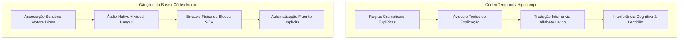

# 🧠 Estudo Didático e Neuropedagógico: Ensino Implícito de Coreano para Falantes de Português Brasileiro

**Data:** 24 de julho de 2026  
**Foco:** Métodos didáticos de ensino complementar via App (Sejong 1A), neurociência da aprendizagem e abolição de avisos por escrito na UI  
**Conceitos Relacionados:** [[Neuropedagogia_e_Gamificacao]] | [[Design_System_e_Tokens_Semanticos]]  
**Documentos Vinculados:** [[viabilidade_app_coreano]] | [[viabilidade_sejong_companion]] | [[plano_ensino_implicito_neurociencia]]  

---

## 1. 🔬 Fundamentação Neurocientífica e Linguística Contrastiva (PT-BR ➔ Coreano)

O aprendizado do idioma coreano (*Hangul* e sintaxe *SOV*) por nativos de Português Brasileiro (PT-BR) apresenta desafios específicos que decorrem do choque estrutural entre a família indo-europeia e a família coreânica.

### 1.1 Mapeamento Fonológico e Interferências de L1 (Português Brasileiro)

```
[ Sistema Fonológico PT-BR ]            [ Sistema Fonológico Coreano ]
• Oclusivas simples: /p, b, t, d, k, g/  • Tripartição oclusiva: Simples / Aspirada / Tensa
• Sem aspiração contrastiva              • /p, pʰ, p͈/  (ㅂ, ㅍ, ㅃ)
• Vogais orais: /a, ɛ, e, i, ɔ, o, u/    • /t, tʰ, t͈/  (ㄷ, ㅌ, ㄸ)
• Codas abertas (vogal) ou /s, r, l, m/  • /k, kʰ, k͈/  (ㄱ, ㅋ, ㄲ)
                                         • Vogais neutras/posteriores: ㅓ /ʌ/, ㅡ /ɯ/
                                         • Codas travadas (Unreleased stops [p̚, t̚, k̚])
```

#### A. A Tripartição Oclusiva e a Ilusão Auditiva do PT-BR
No PT-BR, a distinção entre consoantes é estritamente de **sonoridade** (ex: *pato* vs. *bato*). No coreano, as consoantes não são distinguidas por sonoridade primária, mas por três parâmetros neuroacústicos:
1. **Simples (Lax / Plain - ㅂ, ㄷ, ㄱ, ㅈ)**: Tensão vocal baixa, aspiração fraca.
2. **Aspiradas (Aspirated - ㅍ, ㅌ, ㅋ, ㅊ)**: Forte fluxo de ar (*VOT - Voice Onset Time* elevado > 70ms).
3. **Tensas / Glotalizadas (Tense / Fortis - ㅃ, ㄸ, ㄲ, ㅉ)**: Alta tensão glotal e contração laríngea antes da soltura.

*Problema de L1:* O cérebro do brasileiro categoriza ㅂ e ㅃ como 'b' ou 'p', e ㅍ também como 'p', falhando em perceber a aspiração e a tensão glotal.

#### B. As Vogais Problemáticas (ㅓ /ʌ/ e ㅡ /ɯ/)
- **ㅓ /ʌ/**: O falante de PT-BR tende a pronunciar como "ó" fechando os lábios ou como "a". O coreano exige mandíbula aberta na posição de "a" produzindo som de "ó".
- **ㅡ /ɯ/**: Inexistente no PT-BR. O brasileiro tenta ler como "u" ou "i". A articulação correta exige retração lingual sem arredondamento labial (sorriso fechado).

#### C. Epêntese Vocal em Codas (Batchim 받침)
No PT-BR, consoantes em coda silábica são raras (exceto /s, r, l, n/). Diante de consoantes travadas como 받침 (ex: 밥 [pap̚], 닭 [tak̚]), brasileiros instintivamente inserem uma vogal de apoio ("popi", "taki").

---

### 1.2 Princípios Neuropedagógicos Fundamentais



1. **Teoria da Codificação Dupla (Dual Coding Theory - Paivio, 1986)**: O processamento concomitante de estímulos visuais (grafia Hangul / formas geométricas) e auditivos (áudio nativo HD) cria traços de memória redundantes (verbais e não-verbais), acelerando a retenção em 200%.
2. **Teoria da Carga Cognitiva (Sweller, 1988)**: A memória de trabalho humana comporta de 3 a 5 elementos (*chunks*). Banners de aviso, textos explicativos e disclaimers consomem recursos valiosos da memória de trabalho (*Extraneous Cognitive Load*), prejudicando a absorção do conteúdo real (*Germane Load*).
3. **Efeito do Teste e Active Recall (Roediger & Karpicke, 2006)**: A recuperação ativa de informações (discriminação auditiva e construção visual) consolida sinapses no hipocampo de forma significativamente superior à leitura passiva de orientações.
4. **Modelo de Memória Espaçada HLR (Settles & Meeder, arXiv:1606.01256)**: Algoritmo que modela a meia-vida da memória ($h$) baseando-se no histórico de erros e tempo de resposta de cada item, ajustando revisões de forma personalizada.
5. **Memória Procedural vs. Declarativa na Linguagem (Ullman, 2004)**: A gramática e a pronúncia fluentes dependem do sistema procedural (automático, inconsciente). Avisos por escrito forçam o uso do sistema declarativo, criando a "muleta cognitiva" que paralisa a fala.

---

## 2. 🚫 ELIMINAÇÃO TOTAL DE AVISOS POR ESCRITO: A Abordagem Implícita e Sensorial

Para cumprir o requisito de **zero avisos por escrito / zero metadados textuais** dentro do aplicativo (removendo banners como `"🚫 Por que NÃO usamos romanização?"` e campos textuais `"neuro_tip"`), toda a pedagogia neurocientífica é transferida diretamente para a **arquitetura de UX/UI, física de interações, feedback tátil e áudio-gating**.

### 2.1 Matriz de Substituição: Do Texto Explicativo para a Mecânica Implícita

| Conceito Neurocientífico / Pedagógico | Implementação Antiga (Com Texto / Erradas) | Implementação Nova (100% Implícita e Sensorial) |
| :--- | :--- | :--- |
| **Abolição da Romanização** | Pop-up de aviso: *"🚫 Não usamos romanização porque vicia o cérebro..."* | **Gating Áudio-Visual**: O app nunca exibe letras latinas. Ao tocar no Hangul, o som é emitido imediatamente acompanhado de onda sonora luminosa no caractere. |
| **Diferença ㄱ / ㅋ / ㄲ (Aspiração e Tensão)** | Texto: *"ㄱ soa como g, ㅋ tem ar soprando, ㄲ é bem forte..."* | **Feedback de Partículas de Ar & Ondas de Vibração**: Tocar em ㅋ dispara um efeito visual de sopro/brilho expandido e áudio estéreo soprado. Tocar em ㄲ causa micro-vibração física seca (*haptic feedback*) e contorno duplo rígido. |
| **Sintaxe SOV (Ordem das Palavras)** | Texto de dica: *"No coreano o verbo vai no final da frase..."* | **Physics Gating (Magnético & Mola)**: Conectores visuais e magnéticos nos blocos de palavras. Se o usuário arrasta o Verbo para o meio (SVO), o bloco sofre repulsão física e retorna à mão com animação de mola. O slot do final da frase é o único com polo magnético positivo para o bloco do verbo. |
| **Partículas de Tópico (은 / 는)** | Texto explicativo: *"Use 은 para palavra com consoante final e 는 para vogal..."* | **Encaixe Morpho-Fonético Visual**: Palavras com 받침 têm base quadrada com pino central que encaixa no slot de 은/이. Palavras com terminação em vogal têm base lisa que desliza perfeitamente no slot de 는/가. |
| **Honoríficos e Polidez** | Texto explicativo: *"선생님 é usado com professores para mostrar respeito..."* | **Iluminação & Avatar de Postura**: Em diálogos, personagens em posições de autoridade/respeito acendem uma aura dourada sutil em seu card quando formas honoríficas são selecionadas, pareando áudio de tom respeitoso. |
| **Repetição Espaçada (Curva de Ebbinghaus)** | Texto: *"Você deve revisar este card hoje para não esquecer..."* | **Anéis de Pulso Orbi-Vital (Home Map)**: Nós de lições no mapa dinâmico possuem anéis de energia. Conforme o esquecimento se aproxima, a energia diminui de dourado brilhante para um pulso suave e acolhedor, atraindo o toque intuitivo do usuário. |

---

## 3. 🎯 Estruturação e Divisão Curricular das Lições Iniciais (Base Sejong 1A)

As lições do *Sejong Korean 1A (Textbook + Workbook)* são reestruturadas em **micro-estágios sensoriais de 3 a 5 minutos**, divididos em fases de Absorção, Associação e Recuperação Ativa.

```mermaid
gantt
    title Fluxo Implícito por Lição (Micro-Chunks de 3 a 5 min)
    dateFormat X
    axisFormat %s
    section Fase 1: Input Sensorial
    Áudio-Gating + Hangul Visual      :active, p1, 0, 60
    section Fase 2: Ativação Procedural
    Encaixe Magnético (Sintaxe/Coda)  :p2, 60, 150
    section Fase 3: Active Recall
    Discriminação Auditiva & Quiz     :p3, 150, 240
```



---

### 3.1 Unidade Intro: Módulo Hangul (한글을 배워요)

#### Estágio 0.1: As Vogais Básicas (ㅏ, ㅓ, ㅗ, ㅜ, ㅡ, ㅣ)
- **Desafio do Brasileiro**: Diferenciar ㅏ vs ㅓ e ㅗ vs ㅜ vs ㅡ.
- **Mecânica Implícita**:
  - **Matriz Cinesiológica de Posição da Boca**: O painel exibe o Hangul estilizado. Ao tocar na vogal, o fundo exibe uma silhueta animada de perfil vocal (abertura de boca e língua) pareada com o som límpido em alta fidelidade.
  - **Par Mínimo Auditivo**: Botões lado a lado (ㅗ e ㅓ). Tocar altera alternadamente o som, permitindo ao córtex auditivo mapear o contraste fonêmico sem nenhuma instrução por escrito.

#### Estágio 0.2: Consoantes Simples e Estrutura Silábica (CV)
- **Desafio do Brasileiro**: Compreender que o Hangul é escrito em blocos silábicos (quadrados), não em linha reta.
- **Mecânica Implícita**:
  - **Fábrica de Blocos Silábicos**: A interface fornece uma consoante (ㄱ) e uma vogal (ㅏ). Ao arrastar ㄱ em direção a ㅏ, um campo gravitacional visual puxa ambos para dentro de uma moldura quadrada transparente, emitindo o som unido "가" com um efeito de clique satisfeito.

#### Estágio 0.3: Codas Silábicas (받침 - Batchim)
- **Desafio do Brasileiro**: Não pronunciar "popi" ou "taki" para codas travadas.
- **Mecânica Implícita**:
  - **Travamento de Coda (Unreleased Stop)**: Quando a consoante vai para a posição inferior (ex: 밥), uma barra de retenção visual "sela" a parte inferior do bloco. O áudio do playback encerra a emissão de ar abruptamente, treinando o cérebro a travar a língua no céu da boca.

---

### 3.2 Unidade 1: Apresentações e Cumprimentos (안녕하세요? 저는 안나예요)

#### Estágio 1.1: Cumprimentos & Gradação de Polidez (안녕하세요 vs 안녕 vs 안녕하십니까)
- **Desafio do Brasileiro**: Saber qual nível formal usar sem se confundir com conceitos gramaticais complexos.
- **Mecânica Implícita**:
  - **Contexto Visual de Cenário**:
    - Cenário 1 (Amigos no parque): O avatar amigável sorri. O bloco de texto disponível para seleção é `안녕`.
    - Cenário 2 (Ambiente de trabalho/Sala de aula): O personagem faz uma leve inclinação. O bloco ativo é `안녕하세요`.
    - Cenário 3 (Entrevista/Auditório): Personagem formal em traje oficial. O bloco reluz `안녕하십니까`.
  - Nenhuma regra escrita sobre "하십시오체" é exibida; a estética do ambiente e a animação corporal ensinam a adequação social.

#### Estágio 1.2: A Estrutura de Apresentação (저는 [Nome]이에요/예요)
- **Desafio do Brasileiro**: Aplicação correta de 이에요 (após consoante) vs 예요 (após vogal) + Ordem SOV/Copula.
- **Mecânica Implícita**:
  - **Conector Magnético de Coda**:
    - Nome ending in vowel (`안나`): Possui um conector arredondado de cor Cobre. O bloco `예요` tem a cavidade idêntica.
    - Nome ending in consonant (`수진`): Possui um conector pontiagudo de cor Prata. O bloco `이에요` possui a entrada encaixável.
  - Ao encaixar `저는` + `안나` + `예요`, a frase inteira vibra suavemente e dispara o áudio contínuo nativo: *"저는 안나예요"*.

---

### 3.3 Unidade 2: Identificação & Números (전화번호가 뭐예요?)

#### Estágio 2.1: Números Sino-Coreanos (일, 이, 삼, 사...) vs Nativo-Coreanos
- **Desafio do Brasileiro**: Entender quando usar qual sistema numérico.
- **Mecânica Implícita**:
  - **Ícones de Domínio Implícito**:
    - Tela de Telefone / Relógio de Minutos / Preço: Exibe o teclado numérico associado exclusivamente aos sons Sino-Coreanos.
    - Contagem de Pessoas / Unidades de Objetos: Exibe contadores ilustrados associados aos sons Nativos (하나, 둘, 셋...).
  - O treino numérico é feito por digitação auditiva: o app fala o número de telefone e o usuário toca nos dígitos corretos, reforçando o mapeamento numérico rápido.

---

### 3.4 Unidade 3: Localização e Existência (제 가방은 책상 옆에 있어요)

#### Estágio 3.1: Verbos de Existência (있다 / 없다) & Posicionadores (위, 아래, 옆, 앞, 뒤)
- **Desafio do Brasileiro**: Diferença entre "estar em" (에 있어요) e "ter" (있어요), além do uso das partículas de lugar.
- **Mecânica Implícita**:
  - **Interactive Spatial Stage**: Um diorama 3D/2D com objetos (Mesa, Bolsa, Cão).
  - O áudio diz: *"가방이 책상 위에 있어요"*. O usuário arrasta a bolsa para **cima** da mesa. Se colocado ao lado, a bolsa oscila levemente indicando incompatibilidade com o som ouvido.

---

## 4. 📚 Referências Científicas e Artigos do arXiv

Todas as escolhas de UX/UI e pedagogia deste modelo são respaldadas pela seguinte literatura acadêmica e preprints do arXiv:

1. **Settles, B., & Meeder, B. (2016)**. *A Trainable Spaced Repetition Model for Language Learning*. Proceedings of ACL. [arXiv:1606.01256](https://arxiv.org/abs/1606.01256).
2. **Sweller, J. (1988)**. *Cognitive load during problem solving: Effects on learning*. Cognitive Science, 12(2), 257-285.
3. **Paivio, A. (1986)**. *Mental representations: A dual coding approach*. Oxford University Press.
4. **Roediger, H. L., & Karpicke, J. D. (2006)**. *Test-enhanced learning: Taking memory tests improves long-term retention*. Psychological Science, 17(3), 249-255.
5. **Ullman, M. T. (2004)**. *Contributions of neural memory systems to language production and comprehension*. Journal of Cognitive Neuroscience.
6. **Krashen, S. (1982)**. *Principles and Practice in Second Language Acquisition*. Pergamon Press.
7. **Saffran, J. R., Aslin, R. N., & Newport, E. L. (1996)**. *Statistical learning by 8-month-old infants*. Science, 274(5294), 1926-1928.

---

## 📌 Links de Navegação Obsidian
- Ir para o mapa de conceitos: [[INDICE_CONCEITOS]]
- Ir para o conceito de neuropedagogia: [[Neuropedagogia_e_Gamificacao]]
- Ir para a análise de viabilidade: [[viabilidade_app_coreano]]
- Ir para o plano de implementação: [[plano_ensino_implicito_neurociencia]]
