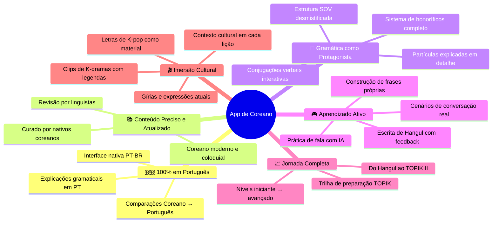
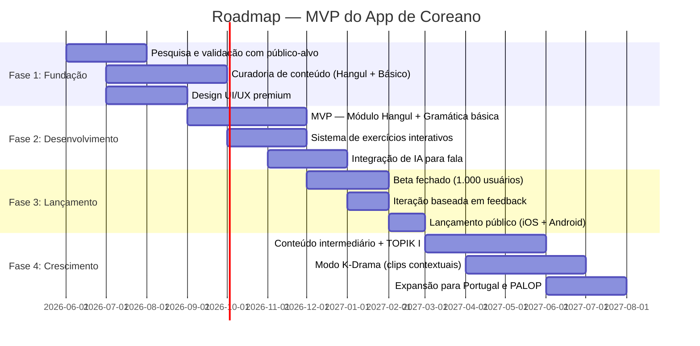

# 📊 Estudo de Viabilidade: App de Ensino de Coreano

**Data:** 06 de maio de 2026  
**Foco:** Análise de mercado, deficiências dos apps existentes e oportunidades de diferenciação

---

## 1. Resumo Executivo

> [!IMPORTANT]
> **Veredicto: ALTAMENTE VIÁVEL** — O mercado de ensino de coreano está em crescimento explosivo (CAGR de 25,1%), com uma lacuna crítica: **nenhum app no mercado oferece ensino completo e preciso de coreano nativamente em português**. Os apps existentes sofrem com conteúdo desatualizado, traduções artificiais, falta de explicação gramatical e abordagens genéricas que não respeitam as particularidades do idioma coreano.

---

## 2. Panorama do Mercado

### 2.1 Tamanho e Crescimento Global

| Indicador | Valor |
|:---|:---|
| Valor do mercado (2024) | **USD 7,2 bilhões** |
| CAGR projetado (2025-2034) | **25,1%** |
| Projeção para 2034 | **USD 67 bilhões** |
| Downloads de apps de idiomas (2024) | **316 milhões** |
| Receita total de apps de idiomas (2024) | **USD 6,34 bilhões** |

### 2.2 Indicadores Específicos do Coreano

- O coreano é uma das **línguas mais estudadas** em plataformas como o Duolingo, **superando o chinês** em interesse dos usuários
- O exame TOPIK (Test of Proficiency in Korean) passou de ~360.000 participantes em 2022 para **mais de 550.000 em 2025**
- A Duolingo ultrapassou **USD 1 bilhão** de receita anual em 2025, com 11,5 milhões de assinantes pagos

### 2.3 Cenário no Brasil e América Latina

| Fato | Detalhe |
|:---|:---|
| **USP** | Criou o primeiro programa de Língua e Literatura Coreana da América do Sul em 2013 — demanda crescente e vagas concorridas |
| **Instituto King Sejong** | Presente em Brasília com aulas de idioma |
| **Centro Cultural Coreano** | Em São Paulo, atende centenas de alunos por ano |
| **Chile** | Universidad Central cresceu de 60 alunos (2019) para centenas de matriculados |
| **TOPIK no Brasil** | Cresce anualmente, mas dados regionais são subnotificados nos relatórios globais |
| **Driver principal** | Hallyu (K-pop, K-dramas) — transformou o interesse em coreano de nicho para mainstream |

---

## 3. Análise dos Concorrentes e Suas Deficiências

> [!CAUTION]
> **A dor central dos usuários:** Nenhum app existente ensina coreano de forma completa, precisa e adaptada para falantes de português. Os problemas vão desde conteúdo factualmente errado até abordagens pedagógicas inadequadas para o idioma.

### 3.1 Duolingo

| Aspecto | Avaliação |
|:---|:---|
| **Pontos Fortes** | Gamificação; criação de hábito; suporte em português; gratuito |
| **Falta de gramática** | ❌ Não explica a estrutura SOV, partículas (은/는 vs 이/가) nem honoríficos |
| **Traduções artificiais** | ❌ Forçam correspondência 1:1, gerando frases que soam estranhas para nativos |
| **Honoríficos confusos** | ❌ Foca na forma 하십시오체 (extremamente formal) sem explicar quando usar |
| **Conteúdo limitado** | ❌ Sem histórias nem exercícios de fala avançados para coreano |
| **Falsa sensação de progresso** | ❌ Prioriza streaks e XP sobre aprendizado real |

### 3.2 LingoDeer

| Aspecto | Avaliação |
|:---|:---|
| **Pontos Fortes** | Excelente explicações gramaticais; treino de Hangul; feito para línguas asiáticas |
| **Teto de nível** | ❌ Não vai além do intermediário; sem conteúdo para níveis C1+ |
| **Prática oral limitada** | ❌ Foco em estrutura, fraca em conversação |
| **Idioma base: inglês** | ❌ **Não disponível em português** — barreira enorme para o público brasileiro |
| **Paywall restritivo** | ❌ Conteúdo avançado exige assinatura sem trial adequado |

### 3.3 Talk To Me In Korean (TTMIK)

| Aspecto | Avaliação |
|:---|:---|
| **Pontos Fortes** | Padrão-ouro em explicações gramaticais; podcast intuitivo |
| **Excesso de inglês** | ❌ Muito tempo em bate-papo e piadas em inglês, pouca densidade linguística |
| **Vocabulário solto** | ❌ Gramática boa, mas vocabulário é "pincelado" — precisa de workbooks extras |
| **Romanização inicial** | ❌ Usa romanização nos níveis iniciais, prejudicando o aprendizado do Hangul |
| **Voz de IA ruim** | ❌ Feedbacks recentes criticam qualidade da voz sintética |
| **Interface datada** | ❌ UX/UI não acompanha os padrões modernos |
| **Sem português** | ❌ Todo o conteúdo é em inglês |

### 3.4 Lingory

| Aspecto | Avaliação |
|:---|:---|
| **Pontos Fortes** | Desenvolvido por coreanos nativos; progressão lógica; interface limpa |
| **Bugs técnicos** | ❌ Problemas com áudio, tela cinza, reconhecimento de teclado |
| **Escopo limitado** | ❌ Cobre apenas até o intermediário baixo |
| **Pronúncia inconsistente** | ❌ Discrepâncias de pronúncia confundem iniciantes |
| **Anúncios** | ❌ Frequência de ads irritante |

### 3.5 Outros Apps (Drops, Busuu, Memrise, Pimsleur)

| App | Problema Principal |
|:---|:---|
| **Drops** | Apenas vocabulário isolado; sem gramática; sem contexto |
| **Busuu** | Genérico; não é feito para coreano; abordagem superficial |
| **Memrise** | Bom para memorização, mas sem estrutura de ensino |
| **Pimsleur** | Caro; sem leitura/escrita; não explica gramática; repetitivo |

---

## 4. Lacunas Críticas do Mercado (Oportunidades)

> [!TIP]
> Estas são as maiores oportunidades para diferenciação. Um novo app que resolver **pelo menos 3-4** dessas lacunas já se posiciona como líder no nicho.

### 4.1 Lacunas Identificadas

```
┌─────────────────────────────────────────────────────────────┐
│  🔴 LACUNA 1: Nenhum app completo em português              │
│  Os melhores apps (LingoDeer, TTMIK, Lingory) são todos     │
│  em inglês. Duolingo tem PT mas é superficial.               │
├─────────────────────────────────────────────────────────────┤
│  🔴 LACUNA 2: Gramática mal explicada ou inexistente         │
│  Partículas, honoríficos, SOV, conjugações — são o núcleo    │
│  do coreano e os apps falham justamente nisso.               │
├─────────────────────────────────────────────────────────────┤
│  🔴 LACUNA 3: Conteúdo desatualizado e datado                │
│  Frases artificiais que ninguém usa; falta de gírias e       │
│  coreano coloquial moderno usado em K-dramas/K-pop.          │
├─────────────────────────────────────────────────────────────┤
│  🔴 LACUNA 4: Teto no nível intermediário                    │
│  Quase todos os apps param no intermediário. Não existe       │
│  jornada completa do iniciante ao avançado (TOPIK I → II).   │
├─────────────────────────────────────────────────────────────┤
│  🔴 LACUNA 5: Sem contexto cultural real                     │
│  Hierarquia social, leitura de ambiente, variações           │
│  regionais e nuances culturais são ignoradas.                │
├─────────────────────────────────────────────────────────────┤
│  🔴 LACUNA 6: Aprendizado passivo demais                     │
│  Apps focam em múltipla escolha. Falta produção ativa:       │
│  fala, escrita criativa e construção de frases próprias.     │
├─────────────────────────────────────────────────────────────┤
│  🔴 LACUNA 7: Sem preparação para TOPIK                      │
│  Nenhum app popular oferece um caminho estruturado de        │
│  preparação para os exames TOPIK I e TOPIK II.               │
└─────────────────────────────────────────────────────────────┘
```

---

## 5. Proposta de Diferenciação

### 5.1 Pilares Estratégicos



### 5.2 Funcionalidades Diferenciadoras

| Funcionalidade | Descrição | Concorrência tem? |
|:---|:---|:---|
| **Modo Contextual** | Cada palavra/gramática mostrada em cenas reais de K-dramas e K-pop | ❌ Nenhum |
| **Explicação Comparativa PT↔KR** | "Em português você diz X, em coreano a estrutura é Y porque..." | ❌ Nenhum |
| **Trilha TOPIK** | Módulos dedicados para preparação TOPIK I e TOPIK II com simulados | ❌ Nenhum (em app) |
| **Honoríficos Interativos** | Simulações sociais: "como falar com seu chefe vs. seu amigo?" | ❌ Nenhum |
| **Prática de Fala com IA** | Conversas simuladas com feedback de pronúncia em tempo real | ⚠️ Parcial (Teuida) |
| **Hangul Lab** | Módulo de caligrafia digital com reconhecimento de traço | ⚠️ Parcial (LingoDeer) |
| **Modo K-Drama** | Assistir clipes reais e aprender vocabulário/gramática em contexto | ❌ Nenhum |
| **Comunidade PT-BR** | Fórum integrado para dúvidas em português, desafios semanais | ❌ Nenhum |

---

## 6. Modelo de Monetização Recomendado

> [!NOTE]
> O modelo **freemium** é o padrão da indústria para maximizar aquisição de usuários. O Duolingo prova que funciona (USD 1B+ em receita). Para um nicho específico (coreano + português), um **freemium premium** com trial generosa é ideal.

### 6.1 Estrutura de Receita

```
┌─────────────────────────────────────────────────────┐
│           MODELO FREEMIUM PREMIUM                    │
├─────────────────────────────────────────────────────┤
│                                                      │
│  🆓 GRATUITO                                         │
│  • Hangul completo (alfabeto)                        │
│  • 30 primeiras lições de gramática                  │
│  • Vocabulário básico (500 palavras)                 │
│  • 1 simulado TOPIK I por mês                        │
│  • Anúncios não-intrusivos                           │
│                                                      │
│  ⭐ PREMIUM (R$ 29,90/mês ou R$ 199,90/ano)          │
│  • Conteúdo completo (todos os níveis)               │
│  • Prática de fala com IA ilimitada                  │
│  • Simulados TOPIK ilimitados                        │
│  • Modo K-Drama completo                             │
│  • Sem anúncios                                      │
│  • Download offline                                  │
│                                                      │
│  💎 PREMIUM+ (R$ 49,90/mês ou R$ 349,90/ano)         │
│  • Tudo do Premium                                   │
│  • Correção de redação por IA avançada               │
│  • Tutoria com nativos (2 sessões/mês)               │
│  • Certificados de conclusão                         │
│  • Acesso antecipado a novos conteúdos               │
│                                                      │
│  🏢 INSTITUCIONAL                                     │
│  • Licenças para escolas e universidades             │
│  • Dashboard para professores                        │
│  • Conteúdo customizável                             │
│                                                      │
└─────────────────────────────────────────────────────┘
```

### 6.2 Projeção Conservadora

| Métrica | Ano 1 | Ano 2 | Ano 3 |
|:---|:---|:---|:---|
| Downloads | 50.000 | 200.000 | 500.000 |
| Conversão para Premium | 5% | 7% | 10% |
| Assinantes pagos | 2.500 | 14.000 | 50.000 |
| Receita anual estimada (R$) | ~R$ 500K | ~R$ 2,8M | ~R$ 10M |

*Premissas: preço médio de R$ 200/ano por assinante, crescimento orgânico via marketing cultural.*

---

## 7. Análise SWOT

### Forças (Strengths)
- 🟢 Primeiro app completo de coreano **em português**
- 🟢 Foco na precisão do conteúdo (curado por nativos + linguistas)
- 🟢 Abordagem que nenhum concorrente oferece (cultural + contextual)
- 🟢 Mercado lusófono sub-explorado (250M+ falantes de português)

### Fraquezas (Weaknesses)
- 🟡 Necessidade de investimento inicial em conteúdo de qualidade
- 🟡 Marca desconhecida competindo com nomes estabelecidos
- 🟡 Equipe precisará incluir nativos coreanos e linguistas

### Oportunidades (Opportunities)
- 🔵 Mercado crescendo 25,1% ao ano
- 🔵 Hallyu Wave sem sinais de desaceleração
- 🔵 Insatisfação documentada dos usuários com apps atuais
- 🔵 Expansão para outros mercados lusófonos (Portugal, Angola, Moçambique)
- 🔵 Parcerias com centros culturais coreanos e universidades
- 🔵 Preparação para TOPIK é uma necessidade não atendida

### Ameaças (Threats)
- 🔴 Duolingo pode melhorar o curso de coreano a qualquer momento
- 🔴 IA generativa democratiza a criação de conteúdo educacional
- 🔴 Concorrentes internacionais podem adicionar suporte a português
- 🔴 Custos de licenciamento de conteúdo (K-dramas, K-pop)

---

## 8. Roadmap Sugerido para MVP



---

## 9. Conclusão e Recomendação

> [!IMPORTANT]
> ### Veredicto Final: **PROJETO VIÁVEL COM ALTO POTENCIAL**
> 
> **Por quê?**
> 1. **Mercado gigante e em crescimento** — USD 7,2B atual, projetado para USD 67B em 2034
> 2. **Dor real dos usuários** — apps existentes são comprovadamente deficientes (gramática ruim, conteúdo errado, sem português)
> 3. **Blue ocean para o público lusófono** — 250M+ falantes de português sem opção adequada
> 4. **Demanda cultural sustentável** — Hallyu Wave é um fenômeno global de longa duração
> 5. **Modelo de monetização comprovado** — freemium funciona na indústria (Duolingo: USD 1B+)
> 6. **Barreiras de entrada moderadas** — o maior investimento é em conteúdo de qualidade, não em tecnologia

### Próximos Passos Recomendados
1. **Validação** — Criar uma landing page e medir interesse (meta: 1.000 inscritos em 30 dias)
2. **Conteúdo piloto** — Produzir 10 lições de Hangul + 10 de gramática básica com nativos
3. **Protótipo** — Desenvolver um MVP focado no Hangul Lab + Gramática comparativa PT↔KR
4. **Testes** — Beta com comunidades de K-pop brasileiras (ex: Twitter/X, Discord, TikTok)
5. **Financiamento** — Considerar crowdfunding (Catarse) ou investidores do setor EdTech

---

> [!NOTE]
> **Fontes consultadas:** Market Research, GM Insights, Business Research Insights, Straits Research, Duolingo Blog, Korea Herald, Korea.net, The Guardian, Reddit (r/Korean, r/languagelearning), Coreano Online, Superprof Brasil, TOPIK Guide, e diversas análises de mercado EdTech de 2024-2025.
